# SSL/TLS Complete Guide for Production Troubleshooting

> This guide is designed for protocol understanding and packet-level troubleshooting of SSL/TLS. TLS behavior varies significantly by version (SSLv3/TLS 1.0-1.0 are deprecated/insecure), library (OpenSSL, BoringSSL, s2n, SChannel, JSSE), and configuration. Validate production conclusions using endpoint documentation and captures/logs taken at multiple points, and always prefer TLS 1.2+ (ideally 1.3) in production.

## Learning Objectives

By the end of this guide, you should be able to:

- Explain the TLS handshake at a message level for both TLS 1.2 and TLS 1.3.
- Distinguish specification-required behavior from library/configuration-specific behavior.
- Read packet captures and logs to diagnose handshake failures, certificate errors, cipher/version mismatches, and session resumption issues.
- Understand where TLS sits relative to TCP/UDP (this guide assumes familiarity with the companion [TCP-Complete-Guide.md](TCP-Complete-Guide.md) and [UDP-Complete-Guide.md](UDP-Complete-Guide.md)).
- Diagnose middlebox interference (TLS inspection proxies, SNI-based filtering, ALPN mishandling) and certificate chain/trust problems.
- Build and defend root-cause hypotheses using evidence-first methodology.

## Prerequisites

- Practical experience with packet captures and transport-layer troubleshooting (TCP required, QUIC/UDP helpful for TLS 1.3-over-QUIC/HTTP3 contexts).
- Familiarity with public-key cryptography basics (asymmetric/symmetric keys, digital signatures, hashing).
- Basic understanding of X.509 certificates, PKI, and certificate authorities.
- Familiarity with HTTP, DNS, and enterprise network segmentation/middleboxes.

## Scope and Accuracy Model

This guide labels behavior as:

- **[SPEC]**: Required by the relevant TLS RFC (mainly RFC 8446 for TLS 1.3, RFC 5246 for TLS 1.2).
- **[COMMON]**: Widely implemented behavior, not strictly mandated.
- **[LIBRARY-SPECIFIC]**: Depends on the TLS stack/library (OpenSSL, BoringSSL, SChannel, JSSE, s2n, LibreSSL, etc.).
- **[CONFIGURABLE]**: Tunable behavior (cipher suite policy, session ticket lifetime, renegotiation policy, verification depth).
- **[DEPRECATED/INSECURE]**: Historically used but should not be relied upon or enabled in production.
- **[TEACHING-SIMPLIFICATION]**: Model used to teach, not a universal runtime constant.

## Table of Contents

- [1. TLS's Role in Network Communication](#1-tlss-role-in-network-communication)
- [2. TLS Versions and Evolution](#2-tls-versions-and-evolution)
- [3. Records, Layers, and Encapsulation](#3-records-layers-and-encapsulation)
- [4. TLS 1.2 Handshake in Depth](#4-tls-12-handshake-in-depth)
- [5. TLS 1.3 Handshake in Depth](#5-tls-13-handshake-in-depth)
- [6. Certificates, Chains, and Trust](#6-certificates-chains-and-trust)
- [7. Cipher Suites and Key Exchange](#7-cipher-suites-and-key-exchange)
- [8. SNI, ALPN, and Extensions](#8-sni-alpn-and-extensions)
- [9. Session Resumption: Session IDs, Tickets, and PSK/0-RTT](#9-session-resumption-session-ids-tickets-and-psk0-rtt)
- [10. Mutual TLS (mTLS) and Client Certificates](#10-mutual-tls-mtls-and-client-certificates)
- [11. Renegotiation and Key Updates](#11-renegotiation-and-key-updates)
- [12. Alerts and Failure Signaling](#12-alerts-and-failure-signaling)
- [13. TLS Termination Points and Connection Topology](#13-tls-termination-points-and-connection-topology)
- [14. Middleboxes: TLS Inspection, SNI Filtering, and Proxies](#14-middleboxes-tls-inspection-sni-filtering-and-proxies)
- [15. Certificate Revocation: CRL and OCSP](#15-certificate-revocation-crl-and-ocsp)
- [16. TLS over UDP: DTLS and QUIC](#16-tls-over-udp-dtls-and-quic)
- [17. Common Failure Modes and Error Messages](#17-common-failure-modes-and-error-messages)
- [18. Wireshark Analysis](#18-wireshark-analysis)
- [19. OpenSSL and Linux Troubleshooting](#19-openssl-and-linux-troubleshooting)
- [20. Troubleshooting Methodology](#20-troubleshooting-methodology)
- [21. Complete Production Case Studies](#21-complete-production-case-studies)
- [22. Interview and Self-Assessment](#22-interview-and-self-assessment)
- [23. Final Reference Material](#23-final-reference-material)

---

## 1. TLS's Role in Network Communication

### 1.1 What TLS Is and Why It Exists

- **What**: TLS (Transport Layer Security) is a cryptographic protocol layered above a reliable transport (almost always TCP; DTLS/QUIC variants exist for UDP) that provides confidentiality, integrity, and endpoint authentication for application data.
- **Why**: TCP/UDP provide no confidentiality or authentication. Applications like HTTPS, SMTP-over-TLS, and database connections need protection against eavesdropping, tampering, and impersonation over untrusted networks.
- **How**: TLS negotiates a shared set of cryptographic algorithms and keys via a handshake, authenticates one or both peers using X.509 certificates, then encrypts/integrity-protects application data using the negotiated symmetric keys.
- **When active**: After the underlying transport connection is established (e.g., after the TCP three-way handshake) and before application data is considered readable/trusted.

| Topic | TLS | Underlying TCP |
|---|---|---|
| Purpose | Confidentiality, integrity, authentication | Reliable ordered delivery |
| Handshake | Cryptographic negotiation + key exchange | 3-way SYN/SYN-ACK/ACK |
| Failure signal | TLS Alert messages | RST, timeout |
| State ownership | Application/library (OpenSSL, etc.) | OS kernel |
| Termination | `close_notify` alert | FIN/RST |

**[SPEC]** TLS runs as its own layer with its own record framing on top of whatever transport carries it; it does not replace or modify TCP's own header/state machine.

### 1.2 Guarantees and Non-Guarantees

- **TLS guarantees (when correctly configured and validated)**: Confidentiality of application data in transit, integrity/tamper-detection, and authentication of at least the server (optionally the client via mTLS).
- **TLS does not guarantee**: Availability, protection against endpoint compromise, protection if certificate validation is disabled/bypassed, or protection against traffic analysis (packet sizes/timing can still leak information).

### 1.3 Endpoint View: What a TLS Stack Tracks

Each TLS connection (conceptually) tracks:

- Negotiated protocol version and cipher suite.
- Handshake state machine position (e.g., waiting for `ServerHello`, waiting for `Finished`).
- Symmetric traffic keys (separate keys per direction, derived from the handshake).
- Session state usable for resumption (session ID, session ticket, or PSK, depending on version).
- Peer certificate chain and validation result.
- Negotiated extensions (ALPN protocol, SNI hostname requested, supported groups, etc.).

### 1.4 Packet Flow Example (HTTPS via TLS 1.3)

| Step | Layer | Message | Notes |
|---|---|---|---|
| 1 | TCP | SYN / SYN-ACK / ACK | Transport handshake completes first |
| 2 | TLS | `ClientHello` | Includes SNI, supported versions, cipher suites, key_share |
| 3 | TLS | `ServerHello` + encrypted extensions + certificate + `Finished` | Server's flight, mostly encrypted after `ServerHello` in TLS 1.3 |
| 4 | TLS | Client `Finished` | Handshake complete, application data can flow |
| 5 | TLS | Application Data records | Encrypted HTTP request/response |
| 6 | TLS | `close_notify` alerts | Graceful TLS-level shutdown before TCP FIN |

### 1.5 Diagram 1: Complete TLS Concept Mind Map

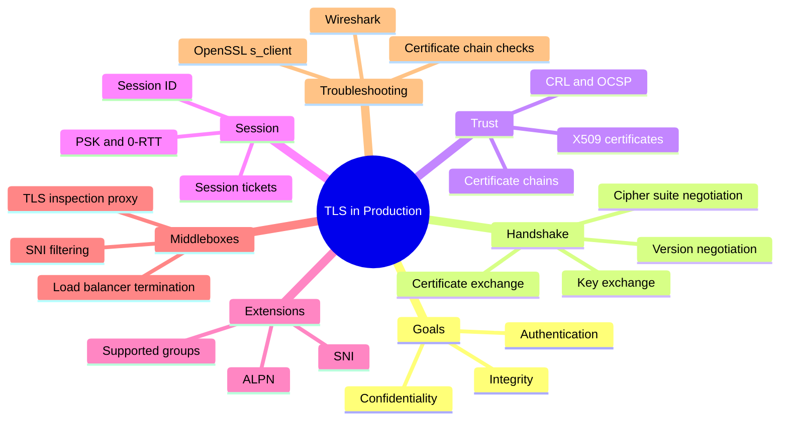

### 1.6 Misconceptions

- "HTTPS" is not a separate protocol from HTTP; it is HTTP carried over a TLS-protected connection.
- A valid TLS handshake does not mean the application data is "safe" if the certificate validation was disabled or misconfigured to trust anything.
- TLS does not hide the destination server name from the network by default when SNI is sent in cleartext (Encrypted Client Hello / ECH is a newer, separate mechanism, not universally deployed).

### 1.7 Troubleshooting Questions

- Did the TCP (or UDP, for DTLS/QUIC) transport connection succeed before TLS even started?
- Which side sent the alert, and what alert description was given?
- Is the failure about protocol/cipher negotiation, certificate trust, hostname mismatch, or something else (clock skew, revocation)?
- Is a middlebox terminating/re-signing TLS (inspection proxy) and presenting its own certificate instead of the origin's?

### 1.8 What I Should Remember

- TLS is a layer on top of transport, with its own handshake, state machine, and alert-based failure signaling, separate from TCP/UDP's own mechanics.
- Nearly every "TLS problem" is really one of: version/cipher mismatch, certificate/trust failure, hostname/SNI mismatch, or a middlebox altering the expected chain.

## 2. TLS Versions and Evolution

| Version | Status | Notes |
|---|---|---|
| SSL 2.0 / SSL 3.0 | **[DEPRECATED/INSECURE]** | Should never be enabled in production; known cryptographic weaknesses (e.g., POODLE for SSLv3) |
| TLS 1.0 / TLS 1.1 | **[DEPRECATED]** | Formally deprecated by RFC 8996; still seen in legacy systems |
| TLS 1.2 | **[COMMON]** | RFC 5246; widely deployed, still secure with modern cipher suites |
| TLS 1.3 | **[COMMON, RECOMMENDED]** | RFC 8446; simplified/faster handshake, removes legacy weak algorithms, encrypts more of the handshake |

### 2.1 Key Differences Between TLS 1.2 and TLS 1.3

- TLS 1.3 removes static RSA key exchange and legacy ciphers (RC4, 3DES, CBC-mode-only suites without AEAD), requiring AEAD cipher suites (e.g., AES-GCM, ChaCha20-Poly1305).
- TLS 1.3 always uses (EC)DHE for forward secrecy; no ephemeral-key-less cipher suites are allowed.
- TLS 1.3 reduces the handshake to effectively 1 round trip (1-RTT) and encrypts the server's certificate and remaining handshake messages, unlike TLS 1.2 which sends them in cleartext.
- TLS 1.3 replaces session IDs/renegotiation-based resumption with PSK-based resumption and optional 0-RTT early data.
- **[COMMON]** Middleboxes designed only for TLS 1.2 visibility (passive decryption via static RSA key) cannot passively decrypt TLS 1.3 traffic because forward secrecy is mandatory; this is a frequent enterprise migration friction point.

### 2.2 What I Should Remember

- Version matters enormously for both security and what a middlebox can/cannot see; always identify the negotiated version first when troubleshooting.

## 3. Records, Layers, and Encapsulation

### Diagram 2: TLS/TCP Encapsulation

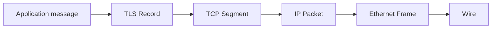

- **TLS record**: The basic framing unit of TLS, with a content type (handshake, alert, application data, change_cipher_spec), version field, length, and payload.
- **Handshake messages**: `ClientHello`, `ServerHello`, `Certificate`, `Finished`, etc. — these are TLS-layer messages, not TCP segments; several handshake messages can be packed into one TLS record, and conversely large messages can span multiple TCP segments.
- **Record size limits**: **[SPEC]** TLS records have a maximum plaintext size (16 KB); larger application data is split across multiple records by the sending stack.

### 3.1 What I Should Remember

- A TLS record is not the same thing as a TCP segment; do not assume 1:1 mapping between them in a capture.

## 4. TLS 1.2 Handshake in Depth

### Diagram 3: TLS 1.2 Full Handshake

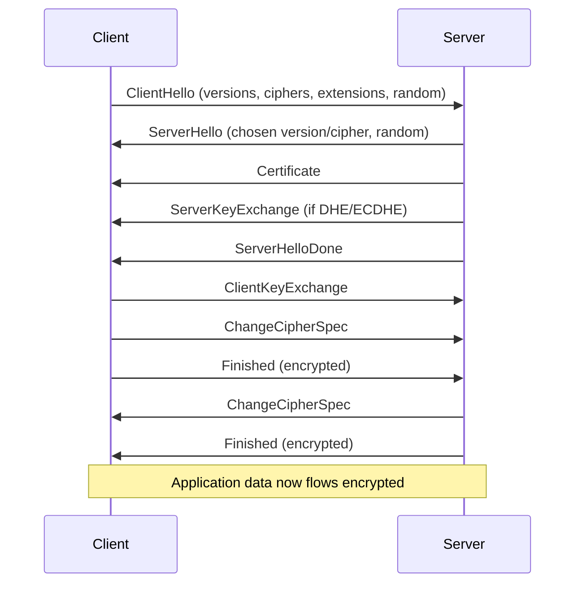

### Key Points

- Certificate and key exchange messages are sent in cleartext in TLS 1.2 (only the `Finished` messages onward are encrypted), meaning a passive observer can see the server's certificate and negotiated parameters.
- `ChangeCipherSpec` signals a switch to the newly negotiated keys; it is a distinct legacy content type not present in TLS 1.3 (a dummy version may still be sent for middlebox compatibility **[COMMON]**).
- Full handshake requires 2 round trips before application data can flow (2-RTT), compared to TLS 1.3's 1-RTT.

### 4.1 What I Should Remember

- TLS 1.2 exposes the server certificate and cipher negotiation to network observers, which is why passive TLS-inspection appliances historically worked with it (given the private key or a decrypting proxy) but not with TLS 1.3's forward-secret-only design.

## 5. TLS 1.3 Handshake in Depth

### Diagram 4: TLS 1.3 Full Handshake (1-RTT)

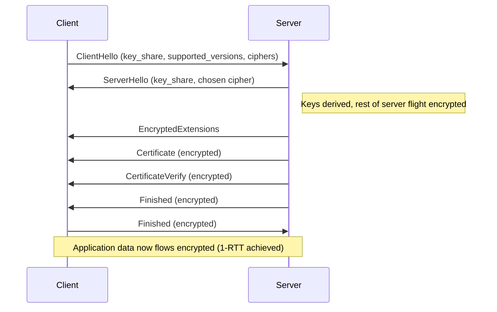

### Key Points

- Only `ClientHello`/`ServerHello` and the key-share negotiation happen before encryption begins; almost everything else (certificate, its verification, extensions) is encrypted, improving both privacy and resistance to some downgrade/middlebox tampering attacks.
- **HelloRetryRequest**: If the server doesn't support any client-offered `key_share` group, it sends a `HelloRetryRequest` asking the client to retry with a different group — this adds a round trip **[SPEC]**, so not every TLS 1.3 handshake is a clean single round trip.
- **0-RTT (early data)**: With a previously established PSK, a client may send application data alongside its first flight before the handshake completes; this trades some replay-safety guarantees for latency, and is **opt-in and only safe for idempotent requests [CONFIGURABLE]**.

### Diagram 5: TLS 1.3 with HelloRetryRequest

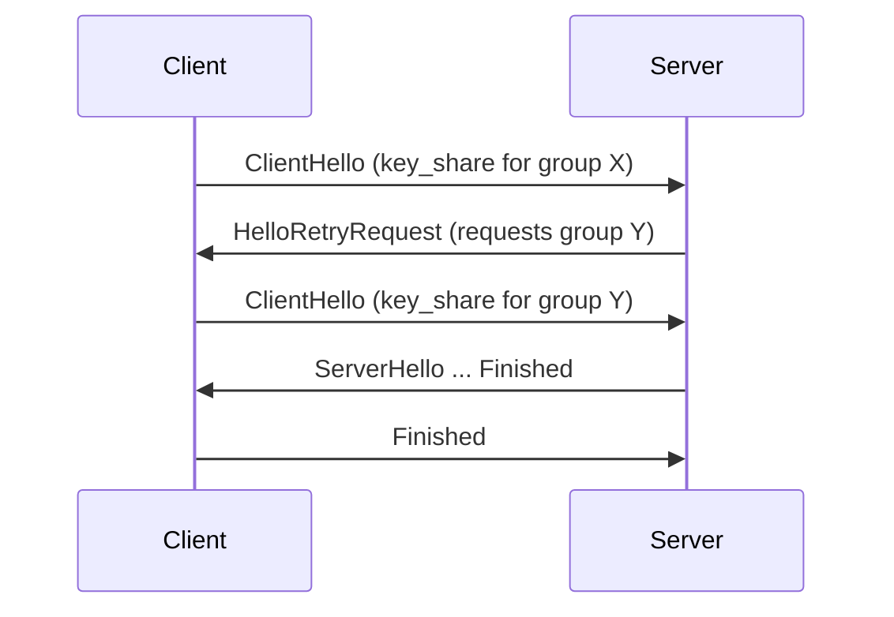

### 5.1 What I Should Remember

- TLS 1.3 is faster and more private by default, but its mandatory forward secrecy breaks passive decryption approaches that some enterprise middleboxes historically relied on for TLS 1.2.

## 6. Certificates, Chains, and Trust

### Core Concepts

- **X.509 certificate**: Binds a public key to an identity (commonly a hostname via Subject Alternative Name), signed by an issuing Certificate Authority (CA).
- **Chain of trust**: Leaf (server) certificate -> one or more intermediate CA certificates -> a root CA certificate that the client already trusts (from its trust store).
- **Validation steps a client performs [SPEC/COMMON]**:
  1. Build a chain from the presented leaf certificate to a trusted root.
  2. Verify each signature in the chain.
  3. Check validity period (`notBefore`/`notAfter`) against current time.
  4. Check the requested hostname against the certificate's Subject Alternative Name (SAN) entries.
  5. Check revocation status if configured (CRL/OCSP — see [Section 15](#15-certificate-revocation-crl-and-ocsp)).
  6. Check key usage/extended key usage constraints (e.g., server authentication).

### Diagram 6: Certificate Chain of Trust

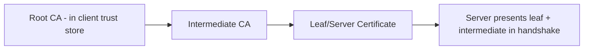

### Common Failure Causes

- Missing intermediate certificate in the server's presented chain (**[COMMON]** — the root/trust anchor should not need to be sent, but a missing intermediate is one of the most frequent production certificate errors).
- Expired certificate (`notAfter` passed) or "not yet valid" (`notBefore` in the future, often due to clock skew).
- Hostname mismatch: client connected to a name not present in the certificate's SAN list (legacy CN-based matching is deprecated **[DEPRECATED]**).
- Self-signed or internally-issued certificate not present in the client's trust store.
- Wrong key usage / not marked valid for server authentication.

### 6.1 What I Should Remember

- Most "SSL certificate error" tickets trace back to one of: missing intermediate, expired cert, hostname/SAN mismatch, or an untrusted root — verify each independently rather than guessing.

## 7. Cipher Suites and Key Exchange

### Core Concepts

- A cipher suite specifies the key exchange algorithm, authentication algorithm, symmetric cipher, and MAC/AEAD construction (TLS 1.2 naming, e.g., `TLS_ECDHE_RSA_WITH_AES_128_GCM_SHA256`); TLS 1.3 simplifies this to just the symmetric cipher/AEAD/hash (e.g., `TLS_AES_128_GCM_SHA256`), since key exchange and authentication are negotiated via separate extensions.
- **Key exchange**: (EC)DHE provides forward secrecy (compromise of the long-term private key doesn't expose past session keys); static RSA key exchange (TLS 1.2 legacy option) does not provide forward secrecy and is disallowed in TLS 1.3.
- **Authentication**: Usually via the certificate's public key (RSA or ECDSA signature), proving the server holds the private key matching its certificate.

### Diagram 7: Cipher Suite Negotiation

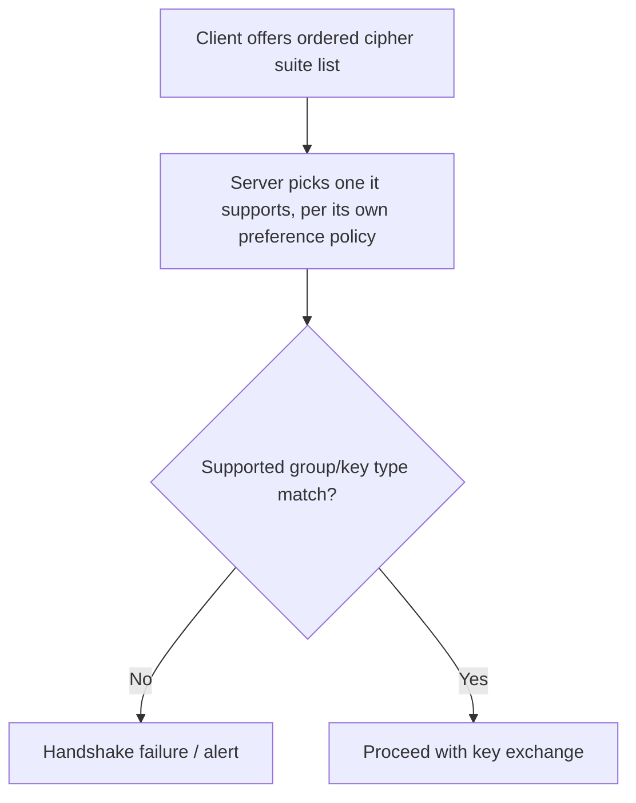

### 7.1 What I Should Remember

- A "no shared cipher suite" failure is a negotiation mismatch between client capability/policy and server capability/policy — check both sides' configured suite lists, not just one.

## 8. SNI, ALPN, and Extensions

### Server Name Indication (SNI)

- **[SPEC/COMMON]** Sent in cleartext within `ClientHello` (unless Encrypted Client Hello is used) so the server can select the correct certificate/virtual host before the handshake proceeds — essential for shared hosting/CDNs serving many hostnames from one IP.
- Missing or incorrect SNI is a common cause of "wrong certificate presented" symptoms behind load balancers, CDNs, and reverse proxies that route based on it.

### Application-Layer Protocol Negotiation (ALPN)

- **[SPEC/COMMON]** Lets the client and server agree on the application protocol (e.g., `h2` for HTTP/2, `http/1.1`) as part of the TLS handshake, avoiding a separate negotiation round trip.
- Middleboxes that don't understand a newer ALPN value can sometimes strip or mishandle the extension, forcing an unexpected protocol downgrade.

### Diagram 8: SNI-Based Routing

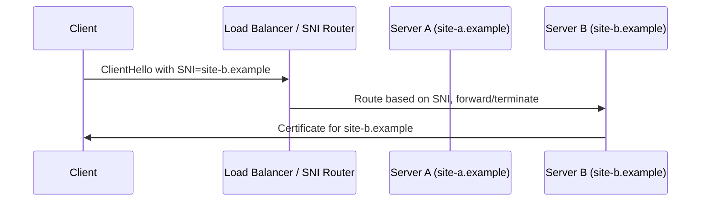

### 8.1 What I Should Remember

- SNI is usually visible on the wire in cleartext and is frequently used for both legitimate routing and network-level filtering; ALPN misbehavior often looks like an unexpected protocol version being used post-handshake.

## 9. Session Resumption: Session IDs, Tickets, and PSK/0-RTT

### TLS 1.2 Mechanisms

- **Session ID resumption [COMMON]**: Server caches session state keyed by an ID; client can offer that ID in a later `ClientHello` to skip full key exchange/certificate verification.
- **Session tickets (RFC 5077) [COMMON]**: Server encrypts session state into an opaque ticket given to the client, removing the need for server-side session cache storage.

### TLS 1.3 Mechanism

- **PSK-based resumption [SPEC]**: After a full handshake, the server issues one or more PSK (pre-shared key) tickets; a later connection can use a PSK to skip the full handshake, optionally combined with (EC)DHE for forward secrecy on the resumed session too.
- **0-RTT early data [CONFIGURABLE, SPEC-defined]**: Using a PSK, the client can send application data in its very first flight, before the handshake completes — this must be used carefully since 0-RTT data lacks the anti-replay protection of the rest of the handshake; servers commonly restrict 0-RTT to idempotent operations.

### Diagram 9: TLS 1.3 Resumption with PSK

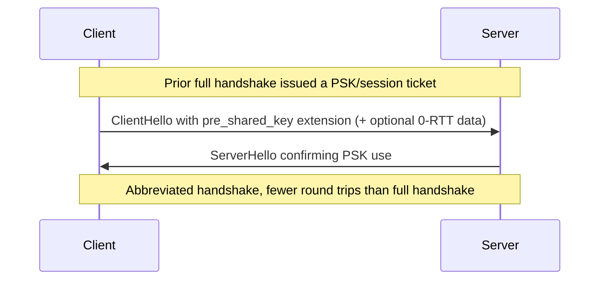

### 9.1 What I Should Remember

- Resumption mechanics differ substantially between TLS 1.2 (session ID/ticket) and TLS 1.3 (PSK, optional 0-RTT); "session reuse doesn't work" tickets should first identify which mechanism and version are in play.

## 10. Mutual TLS (mTLS) and Client Certificates

### Core Concepts

- In standard TLS, only the server is authenticated via certificate; **mTLS** additionally requires the client to present a certificate that the server validates against its own trusted CA set.
- Handshake addition: server sends a `CertificateRequest` message; client responds with its own `Certificate` and a `CertificateVerify` proving possession of the matching private key.

### Diagram 10: mTLS Handshake Addition

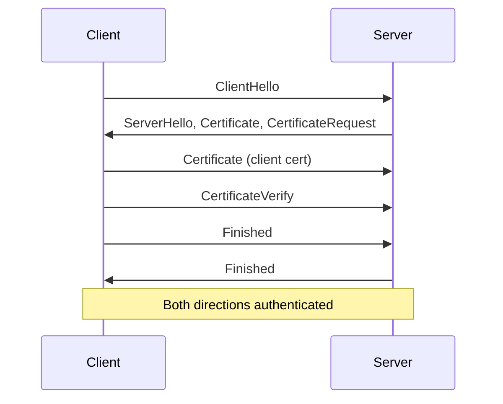

### Common Failure Causes

- Client certificate not trusted by the server's configured CA bundle.
- Client certificate expired, revoked, or missing required key usage (client authentication EKU).
- Client failing to present any certificate when the server requires one (some servers allow anonymous fallback, others hard-fail).

### 10.1 What I Should Remember

- mTLS failures are symmetric to regular TLS certificate failures, but from the server validating the client instead of the reverse — check the server's trusted CA bundle and the client cert's validity/EKU first.

## 11. Renegotiation and Key Updates

- **TLS 1.2 renegotiation [DEPRECATED-leaning, COMMON legacy feature]**: Allowed re-running the handshake within an existing connection (e.g., to request a client certificate mid-session); historically vulnerable to a renegotiation-injection attack (addressed by RFC 5746's renegotiation_info extension).
- **TLS 1.3 KeyUpdate [SPEC]**: Replaces renegotiation with a simpler, safer `KeyUpdate` message that rotates traffic keys without renegotiating the whole session or identity.

### 11.1 What I Should Remember

- TLS 1.3 intentionally removed renegotiation in favor of `KeyUpdate`; if troubleshooting an old system that relies on renegotiation (e.g., to request a client cert mid-connection), that pattern needs redesign for TLS 1.3-only environments.

## 12. Alerts and Failure Signaling

### Core Concept

- **[SPEC]** TLS alerts are the protocol's explicit failure/close signaling mechanism, analogous in spirit to TCP's RST but at the TLS layer. Alerts have a level (`warning` or `fatal`) and a description code.

### Common Alert Descriptions

| Alert | Typical Meaning |
|---|---|
| `close_notify` | Graceful shutdown signal (not an error) |
| `unexpected_message` | Malformed or out-of-sequence handshake message |
| `bad_record_mac` | Integrity check failed — corruption, tampering, or key mismatch |
| `handshake_failure` | Generic negotiation failure (e.g., no shared parameters) |
| `certificate_expired` | Peer certificate is outside its validity window |
| `certificate_unknown` | Certificate rejected for an unspecified/other reason |
| `unknown_ca` | Certificate chain doesn't lead to a trusted root |
| `access_denied` | Valid certificate, but access policy denied it (common in mTLS) |
| `decrypt_error` | Signature/key-exchange verification failed |
| `protocol_version` | Peer doesn't support the offered/requested TLS version |
| `insufficient_security` | Server requires stronger parameters than the client offered |
| `internal_error` | Unrelated to the peer's input; local failure on the sender's side |
| `user_canceled` | Handshake canceled for a reason unrelated to protocol failure |
| `no_application_protocol` | ALPN negotiation failed to find a common protocol |

### Diagram 11: Alert-Driven Failure

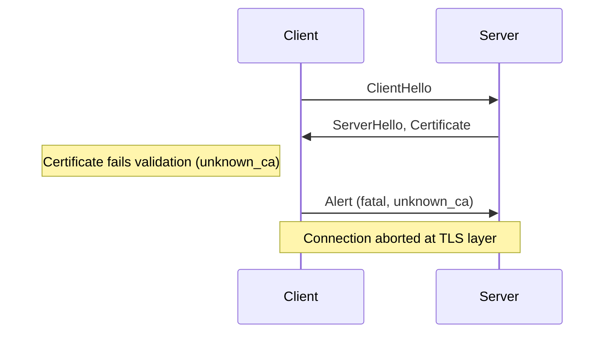

### 12.1 What I Should Remember

- The alert description is the single most useful piece of evidence in a TLS failure — always capture and quote it exactly rather than paraphrasing "SSL error."

## 13. TLS Termination Points and Connection Topology

### Diagram 12: TLS Termination Patterns

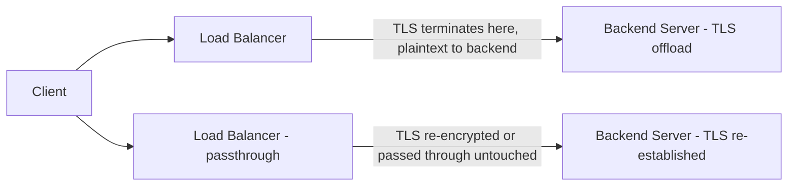

| Pattern | Description | Implication |
|---|---|---|
| TLS offload/termination at LB | LB holds the certificate/private key, decrypts, forwards plaintext (or re-encrypts) to backend | Backend-to-LB link security depends on separate configuration; cert lives only at the LB |
| TLS passthrough | LB forwards encrypted bytes untouched (often via SNI-based routing) to the real TLS endpoint | Backend server owns the actual certificate and handshake |
| TLS re-encryption (bridging) | LB terminates client TLS, then initiates a new TLS connection to the backend | Two independent TLS sessions/certificates exist end to end |

### 13.1 What I Should Remember

- Always identify which device actually terminates TLS (holds the private key and completes the handshake) before assuming a captured certificate belongs to the "real" origin server.

## 14. Middleboxes: TLS Inspection, SNI Filtering, and Proxies

### Core Concepts

- **TLS inspection proxy [COMMON in enterprise networks]**: Intercepts client TLS connections, presents its own (often internally-issued) certificate to the client, and separately establishes TLS to the real destination — this requires the inspecting CA to be trusted by the client, and is only possible because the organization controls client trust stores.
- **SNI-based filtering [COMMON]**: Firewalls/proxies can allow or block connections based on the cleartext SNI value without needing to decrypt anything.
- **Version/downgrade friction**: Some older middleboxes mishandle unfamiliar TLS 1.3 extensions or `HelloRetryRequest`, occasionally causing clients to fall back to TLS 1.2 or fail outright.

### Diagram 13: TLS Inspection Proxy

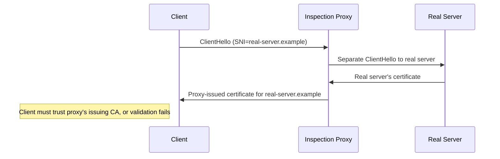

### Troubleshooting Implication

- A certificate chain in a capture that doesn't match the expected public CA (e.g., issued by an internal/corporate CA) strongly suggests a TLS inspection proxy is in the path, not a misconfigured origin server.

### 14.1 What I Should Remember

- Before assuming a certificate problem is the origin server's fault, check whether the presented issuing CA matches the expected public/internal CA — proxy-substituted certificates are a common false alarm.

## 15. Certificate Revocation: CRL and OCSP

### Core Concepts

- **CRL (Certificate Revocation List) [COMMON]**: A CA-published, periodically updated list of revoked certificate serial numbers that clients can download and check against.
- **OCSP (Online Certificate Status Protocol) [COMMON]**: A real-time, per-certificate revocation status query to an OCSP responder, avoiding the need to download an entire list.
- **OCSP stapling [CONFIGURABLE, COMMON]**: The server itself fetches a signed OCSP response from the CA and "staples" it into the handshake, so the client doesn't need to contact the OCSP responder directly — reduces latency and avoids a common failure mode where clients cannot reach the OCSP responder due to network policy.

### Diagram 14: OCSP Stapling vs Direct OCSP

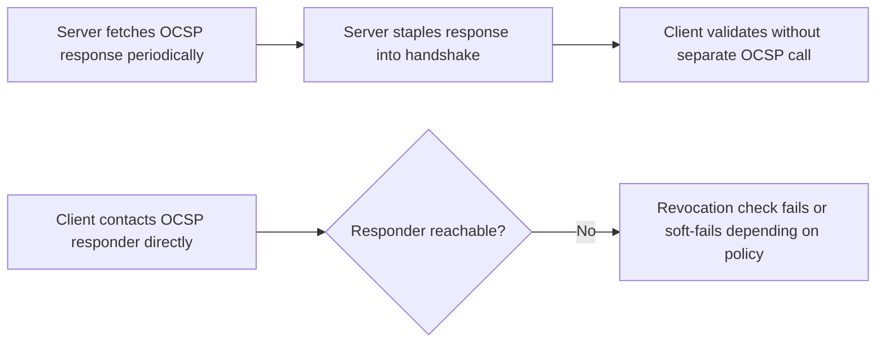

### 15.1 What I Should Remember

- Revocation-checking failures (blocked OCSP responder, stale CRL) are a frequently overlooked cause of intermittent handshake failures that look unrelated to the certificate itself; OCSP stapling avoids much of this fragility.

## 16. TLS over UDP: DTLS and QUIC

- **DTLS [SPEC, RFC 9147 for DTLS 1.3]**: A TLS variant adapted for unreliable, unordered UDP transport (used by some VPNs and WebRTC media encryption); it adds explicit sequence numbers and replay-detection windows since UDP itself provides none (see the companion [UDP-Complete-Guide.md](UDP-Complete-Guide.md), [Section 7](UDP-Complete-Guide.md#7-absence-of-flow-control-and-congestion-control)).
- **QUIC's integrated TLS 1.3 [SPEC, RFC 9001]**: QUIC uses TLS 1.3 handshake messages carried within its own encrypted frame structure, rather than DTLS, to authenticate and key the connection; the TLS handshake state and QUIC transport state are cryptographically bound together.

### 16.1 What I Should Remember

- Not all "TLS over UDP" is the same mechanism — DTLS and QUIC's embedded TLS 1.3 are distinct designs solving the reliability gap differently.

## 17. Common Failure Modes and Error Messages

| Symptom / Message | Likely Layer | Likely Cause |
|---|---|---|
| `SSL_ERROR_NO_CYPHER_OVERLAP` / handshake_failure | Negotiation | No common cipher suite/version between client and server policy |
| `certificate has expired` | Certificate validation | `notAfter` passed, or client clock is wrong |
| `unable to get local issuer certificate` | Certificate validation | Missing intermediate certificate in server's chain |
| `unable to get issuer certificate` | Certificate validation | Root not present in client trust store |
| `hostname mismatch` / `certificate name mismatch` | Certificate validation | Connected hostname not in certificate SAN list |
| `self signed certificate in certificate chain` | Certificate validation | Self-signed cert not explicitly trusted by client |
| `ERR_SSL_PROTOCOL_ERROR` (browser) | Framing/negotiation | Non-TLS data sent to a TLS port, or severe version mismatch |
| Connection resets exactly during handshake | Middlebox | SNI-based block, TLS inspection failure, or version/extension incompatibility |
| Works with `curl -k` but not without | Certificate validation | Confirms it's specifically a trust/validation issue, not connectivity |

### 17.1 What I Should Remember

- Reproducing a failure while explicitly bypassing certificate validation (e.g., `curl -k`, `openssl s_client` ignoring verification) is one of the fastest ways to confirm whether an issue is transport/negotiation-related versus purely a trust/validation problem.

## 18. Wireshark Analysis

Practical focus points:

- Filter to the TLS handshake messages and read `ClientHello`/`ServerHello` fields directly (version, cipher suites offered/chosen, SNI, ALPN, key_share groups).
- For TLS 1.2, the certificate chain is visible in cleartext in the capture; for TLS 1.3, it is encrypted and not visible without a decryption key.
- If a TLS private key or `SSLKEYLOGFILE`-captured session secrets are available (test/lab environments only), Wireshark can decrypt and show application data — never do this with production private keys/secrets outside an authorized, controlled environment.
- Alert messages show up as a distinct TLS content type with level and description fields — always check these first for handshake failures.

Common filters:

```wireshark
tls.handshake.type == 1
tls.handshake.type == 2
tls.handshake.extensions_server_name
tls.handshake.extensions_alpn_str
tls.alert_message
tls.record.content_type == 21
tls.handshake.type == 4
```

Limitations:

- TLS 1.3 hides most post-`ServerHello` content from passive observation; captures alone often cannot show certificate details without a decryption key.
- A capture cannot show why an application-layer certificate validation library rejected a chain (e.g., a custom pinning policy) — that requires client-side logs.

### 18.1 What I Should Remember

- For TLS 1.3, expect far less to be visible in a plain capture than for TLS 1.2 — plan to lean on endpoint logs, alert descriptions, and (in test environments) key logging rather than passive decryption.

## 19. OpenSSL and Linux Troubleshooting

Useful commands:

```bash
openssl s_client -connect host:443 -servername host
openssl s_client -connect host:443 -tls1_2
openssl s_client -connect host:443 -tls1_3
openssl x509 -in cert.pem -noout -text
openssl x509 -in cert.pem -noout -dates
openssl verify -CAfile ca-bundle.pem cert.pem
openssl s_client -connect host:443 -showcerts
curl -vI https://host
curl -v --cacert ca-bundle.pem https://host
curl -vk https://host
```

Inspection goals:

- Confirm negotiated protocol version and cipher suite (`openssl s_client` output, or `-tls1_2`/`-tls1_3` to force a version and isolate negotiation issues).
- Inspect certificate validity dates, SAN entries, and issuer chain (`openssl x509 -text`).
- Explicitly verify a chain against a known CA bundle (`openssl verify`) to isolate trust-store issues from live handshake issues.
- Compare `curl -vk` (skips verification) against plain `curl -v` to isolate "connectivity/negotiation" from "trust/validation" failures.

Risk note:

- Do not disable certificate verification (`-k`, custom trust-all code) in production; use it only as a diagnostic step in a controlled test, and revert immediately.

### 19.1 What I Should Remember

- `openssl s_client` combined with forcing specific versions is the fastest way to isolate whether a failure is version/cipher negotiation versus certificate trust versus something else entirely.

## 20. Troubleshooting Methodology

Repeatable workflow:

1. Confirm the underlying transport (TCP handshake, or UDP path for DTLS/QUIC) succeeded before blaming TLS.
2. Capture the exact TLS alert (level + description) from both sides if possible.
3. Identify negotiated (or attempted) TLS version and cipher suite.
4. Identify which device actually terminates TLS (check certificate issuer/subject against expectations).
5. Validate the certificate chain independently (`openssl verify`, chain completeness, expiry, SAN match).
6. Check revocation-checking behavior (OCSP reachability, stapling presence) if failures are intermittent.
7. Check for middlebox interference (SNI filtering, inspection proxy substituting certificates).
8. Reproduce with verification disabled as a diagnostic (never in production) to isolate trust vs. negotiation issues.
9. Compare a known-working client/server pair against the failing one.
10. Separate evidence (alert codes, cert fields, negotiated version) from assumption.
11. Validate the root-cause hypothesis with a safe, reversible test.

### Diagram 15: TLS Troubleshooting Decision Tree

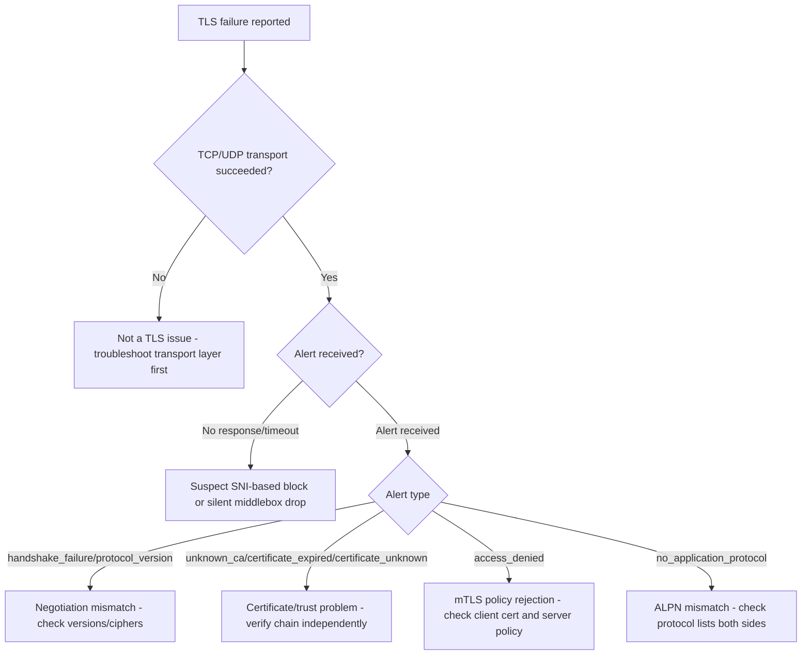

### 20.1 What I Should Remember

- The TLS alert description, when available, should drive the very next diagnostic step; when no alert is seen at all, suspect a middlebox silently dropping traffic rather than a clean protocol-level rejection.

## 21. Complete Production Case Studies

### Case 1: Missing intermediate certificate

| Field | Detail |
|---|---|
| Topology | Client -> Internet -> Web server |
| User-visible symptom | Some clients/browsers fail with trust errors, others succeed |
| Expected flow | Server presents leaf + intermediate; client chains to a trusted root |
| Actual flow | Server presents leaf only; clients without a cached copy of the intermediate fail |
| Key evidence | `openssl s_client -showcerts` shows only one certificate in the chain |
| Distinguishers | Failing clients lack the intermediate in their local store/cache; some browsers cache intermediates from prior visits, masking the issue there |
| Next step | Configure server to present the full chain (leaf + intermediate) |
| Safe validation | Test in a clean client environment/container without cached intermediates |
| Learning point | "Some users affected, others not" for cert trust often means an incomplete server-side chain rather than a client-specific problem |

### Case 2: TLS 1.3 handshake silently failing behind a legacy inspection proxy

| Field | Detail |
|---|---|
| Topology | Client -> Enterprise TLS inspection proxy -> Internet -> Server |
| User-visible symptom | Some HTTPS sites fail intermittently for internal users only |
| Expected flow | TLS 1.3 handshake with HelloRetryRequest support completes normally |
| Actual flow | Proxy mishandles unfamiliar TLS 1.3 extension/HelloRetryRequest, resets or corrupts the handshake |
| Key evidence | Capture shows `ClientHello` sent, then a reset or malformed response instead of a `ServerHello` |
| Distinguishers | Forcing `-tls1_2` in a controlled test succeeds where TLS 1.3 fails |
| Next step | Update/patch the inspection proxy for TLS 1.3 support, or scope a documented exception |
| Safe validation | Lab-test the affected sites through the proxy with TLS 1.3 forced, before wider config changes |
| Learning point | Legacy middlebox TLS 1.3 support gaps are a common enterprise migration blocker |

### Case 3: mTLS access_denied after certificate rotation

| Field | Detail |
|---|---|
| Topology | Service A (client) -> Service B (server, requires mTLS) |
| User-visible symptom | Inter-service calls start failing right after a certificate rotation |
| Expected flow | Client presents a certificate signed by a CA that Service B trusts |
| Actual flow | New client certificate signed by a CA not yet added to Service B's trust bundle |
| Key evidence | TLS alert `access_denied` or `unknown_ca` observed at handshake time, timestamps align with rotation |
| Distinguishers | Rolling back to the previous client certificate temporarily restores connectivity |
| Next step | Update Service B's trusted CA bundle to include the new issuing CA before/alongside rotation |
| Safe validation | Stage the new CA in Service B's trust bundle in a canary environment first |
| Learning point | Certificate rotations must be coordinated with every relying party's trust bundle, not just the certificate holder |

### Case 4: OCSP responder unreachable causing intermittent handshake delay/failure

| Field | Detail |
|---|---|
| Topology | Client (enforces live OCSP checking, no stapling) -> Internet -> Server |
| User-visible symptom | Occasional slow or failed HTTPS connections, inconsistent across networks |
| Expected flow | Client validates certificate and completes revocation check quickly |
| Actual flow | Client blocked from reaching the OCSP responder by an egress firewall policy on some networks |
| Key evidence | Failures correlate with client network location; disabling revocation checking as a diagnostic step removes the symptom |
| Distinguishers | Server enabling OCSP stapling removes the client's need to contact the responder directly |
| Next step | Enable OCSP stapling on the server, and/or permit OCSP responder egress from affected networks |
| Safe validation | Test stapling in a canary environment and confirm handshake latency/success improves |
| Learning point | Revocation-checking network dependencies are an often-overlooked cause of "sometimes TLS is slow/fails" symptoms |

### 21.1 What I Should Remember

- Recurring themes in TLS incidents: incomplete certificate chains, legacy middlebox incompatibility with TLS 1.3, trust-bundle coordination during certificate rotation, and revocation-check network dependencies.

## 22. Interview and Self-Assessment

### 22.1 Foundational Questions (20)

1. What three properties does TLS provide?
2. What layer does TLS operate at relative to TCP?
3. What is the main structural difference between the TLS 1.2 and TLS 1.3 handshakes?
4. Why can TLS 1.3 complete in 1-RTT?
5. What triggers a `HelloRetryRequest`?
6. What is SNI and why is it usually sent in cleartext?
7. What does ALPN negotiate?
8. What is the difference between a session ID and a session ticket?
9. What is 0-RTT data and what risk does it carry?
10. What does forward secrecy mean, and which key exchange provides it?
11. Why can't TLS 1.3 traffic typically be passively decrypted by a static-RSA-based inspection appliance?
12. What is the purpose of `CertificateVerify` in mTLS?
13. What replaced renegotiation in TLS 1.3?
14. What is the difference between a `warning` and `fatal` TLS alert?
15. What does `unknown_ca` indicate?
16. What is the difference between CRL and OCSP?
17. What does OCSP stapling avoid?
18. What is DTLS and why does it need explicit sequence/replay handling?
19. How does QUIC use TLS 1.3 differently from a typical TCP+TLS stack?
20. Why does a missing intermediate certificate cause trust failures for only some clients?

<details>
<summary>Answers: Foundational 20</summary>

1. Confidentiality, integrity, and authentication.
2. Above the transport layer (typically TCP), below the application layer.
3. TLS 1.2 sends certificate/key exchange in cleartext across two round trips; TLS 1.3 encrypts almost everything after `ServerHello` and completes in one round trip.
4. Because the client sends a key share in its first `ClientHello`, letting both sides derive keys immediately after `ServerHello`.
5. The server not supporting any of the client's offered key-share groups.
6. It's a `ClientHello` extension letting the server pick the right certificate/virtual host; it must be readable before the server has an encrypted channel to share it over.
7. The application-layer protocol to use over the connection (e.g., HTTP/2 vs HTTP/1.1).
8. A session ID is a server-cached lookup key; a session ticket is an opaque, encrypted blob holding session state given to the client, removing server-side cache requirements.
9. Sending early application data using a PSK before the handshake finishes; it risks replay since there's no full handshake freshness guarantee yet.
10. The property that compromising a long-term private key doesn't expose past session traffic; provided by (EC)DHE key exchange.
11. Because TLS 1.3 mandates ephemeral (forward-secret) key exchange, so there's no static key that a device holding the certificate's private key can use to derive session keys after the fact.
12. It proves the client possesses the private key matching the certificate it presented.
13. The `KeyUpdate` message.
14. A `warning` alert may allow the connection to continue (implementation-dependent); a `fatal` alert always terminates the connection.
15. The certificate chain could not be built to a root the peer trusts.
16. CRL is a downloaded list of revoked certificate serial numbers; OCSP is a real-time per-certificate status query to a responder.
17. It avoids the client needing to contact the OCSP responder directly, reducing latency and dependency on that separate network path.
18. A TLS variant adapted for unreliable/unordered UDP transport; it adds its own sequence numbers and replay windows since UDP provides none.
19. QUIC embeds TLS 1.3 handshake messages within its own encrypted frame/transport structure and cryptographically binds the TLS and transport state together, rather than layering TLS over a separate reliable transport.
20. Because some clients may have a cached copy of the missing intermediate from a prior connection to another site, while others do not and therefore fail to build the chain.

</details>

### 22.2 Intermediate and Scenario Questions (15)

1. A handshake fails with `handshake_failure` — what's the first thing to check?
2. `curl -k` succeeds but plain `curl` fails — what does this prove?
3. Why might TLS 1.3 traffic break through an old enterprise proxy that TLS 1.2 traffic does not?
4. A certificate looks valid via `openssl x509 -text` but the client still rejects it — what should you check next?
5. Why would enabling OCSP stapling reduce intermittent handshake failures?
6. Why does an mTLS `access_denied` alert usually point away from a plain negotiation problem?
7. What's the significance of seeing a `HelloRetryRequest` in a capture?
8. Why can't you see the server certificate in a TLS 1.3 packet capture without a key log?
9. A load balancer presents a different certificate issuer than expected — what topology should you suspect?
10. Why is disabling certificate verification acceptable only as a temporary diagnostic step?
11. What's the risk of relying on 0-RTT data for a non-idempotent API call?
12. Why might a certificate rotation cause failures for downstream services but not the service being rotated itself?
13. What evidence distinguishes a TLS inspection proxy from a genuinely misconfigured origin certificate?
14. Why does forcing `-tls1_2` in a diagnostic test help isolate a TLS 1.3-specific issue?
15. Why is SNI-based filtering possible without decrypting any TLS traffic?

<details>
<summary>Answers: Intermediate 15</summary>

1. Whether client and server share a common TLS version and cipher suite/key-exchange group — a negotiation policy mismatch.
2. It proves the failure is specifically about certificate trust/validation, not connectivity or protocol negotiation.
3. TLS 1.3 encrypts more of the handshake and uses unfamiliar extensions/HelloRetryRequest flows that older proxies weren't built to parse or forward correctly.
4. Whether the chain (including intermediates) is complete and whether the client's trust store actually contains the corresponding root; validity fields alone don't guarantee trust-path completeness.
5. It removes the client's dependency on reaching an external OCSP responder over the network, which is a common source of network-policy-related delays/failures.
6. Because `access_denied` typically means the handshake/negotiation succeeded and a valid certificate was presented, but a policy layer (authorization) rejected it.
7. The server didn't support any client-offered key-share group and asked the client to retry with a different one — an extra round trip, not necessarily an error.
8. TLS 1.3 encrypts the certificate and most handshake messages after `ServerHello`; without the session's derived keys (via a key log in a controlled test environment) a passive capture cannot decode them.
9. TLS termination/offload or a TLS inspection proxy at the load balancer, rather than passthrough to the real origin server.
10. Because it removes the exact protection (trust validation) that TLS is meant to provide, and should never be left in place for real traffic.
11. Early data lacks the full handshake's anti-replay guarantee, so a captured/replayed 0-RTT request could cause a non-idempotent action to execute more than once.
12. Because relying/downstream services validate the rotated certificate against their own trust bundles, which must be updated separately from the rotation itself.
13. Comparing the presented certificate's issuing CA against the expected public/internal CA; an unexpected internal/corporate CA strongly suggests an inspection proxy.
14. It removes TLS 1.3-specific extensions/flows from the equation, so if the connection succeeds under TLS 1.2 but fails under 1.3, the issue is isolated to 1.3-specific handling somewhere in the path.
15. Because SNI is sent in cleartext within the `ClientHello` (absent Encrypted Client Hello), letting network devices inspect and filter on it without needing to decrypt anything.

</details>

### 22.3 What I Should Remember

- Strong TLS troubleshooting is demonstrated by precisely separating negotiation failures, trust/validation failures, policy-based rejections, and middlebox interference — and by using the alert description and independent chain verification as primary evidence rather than guessing from vague "SSL error" reports.

## 23. Final Reference Material

### 23.1 Glossary

- **Handshake**: The initial TLS message exchange that negotiates parameters and establishes keys.
- **Record**: The basic TLS framing unit (handshake, alert, change_cipher_spec, or application data content type).
- **Cipher suite**: The combination of key exchange, authentication, symmetric cipher, and MAC/AEAD algorithms in use.
- **Forward secrecy**: Property where compromise of a long-term private key does not expose past session keys.
- **SNI**: Server Name Indication, a `ClientHello` extension identifying the requested hostname.
- **ALPN**: Application-Layer Protocol Negotiation, a handshake extension selecting the app protocol.
- **PSK**: Pre-shared key, used in TLS 1.3 for session resumption and optional 0-RTT.
- **mTLS**: Mutual TLS, where both client and server present and validate certificates.
- **CRL / OCSP**: Certificate revocation list / online certificate status protocol, two revocation-checking mechanisms.

### 23.2 TLS Handshake Message Cheat Sheet

| Message | Sent By | Purpose |
|---|---|---|
| `ClientHello` | Client | Proposes versions, ciphers, extensions, key shares |
| `ServerHello` | Server | Selects version/cipher, provides its key share |
| `EncryptedExtensions` (1.3) | Server | Carries extensions not needed for key derivation |
| `Certificate` | Server (and client for mTLS) | Presents the certificate chain |
| `CertificateVerify` | Server (and client for mTLS) | Proves possession of the private key |
| `Finished` | Both | Confirms handshake integrity using derived keys |
| `CertificateRequest` | Server (mTLS only) | Requests a client certificate |
| `HelloRetryRequest` (1.3) | Server | Asks client to retry with different parameters |
| `KeyUpdate` (1.3) | Either | Rotates traffic keys mid-session |
| Alert | Either | Signals warnings or fatal errors, including graceful close |

### 23.3 TLS 1.2 vs TLS 1.3 Quick Comparison

| Aspect | TLS 1.2 | TLS 1.3 |
|---|---|---|
| Round trips for full handshake | 2-RTT | 1-RTT (2-RTT if HelloRetryRequest) |
| Certificate visibility on wire | Cleartext | Encrypted |
| Key exchange | Static RSA or (EC)DHE | (EC)DHE only (forward secrecy mandatory) |
| Resumption | Session ID / session ticket | PSK, optional 0-RTT |
| Renegotiation | Supported (legacy risk area) | Removed; replaced by `KeyUpdate` |
| Passive decryption by static-key holder | Possible with static RSA suites | Not possible (forward secrecy mandatory) |

### 23.4 Common Misconceptions and Corrections

- "SSL" and "TLS" are different protocols in current use -> **No, "SSL" is legacy terminology; modern deployments use TLS, though the term "SSL" is still used colloquially.**
- HTTPS encrypts the destination hostname from the network -> **Not by default; SNI is typically sent in cleartext unless Encrypted Client Hello is deployed.**
- A valid TLS handshake proves the application data is trustworthy -> **No, it proves the channel is authenticated/encrypted; certificate validation must not be bypassed, and application-layer trust decisions are separate.**
- TLS 1.3 is always exactly 1 round trip -> **No, a `HelloRetryRequest` adds a round trip when needed.**
- More cipher suites enabled is always safer -> **No, minimizing to strong, modern, forward-secret suites is safer than maximizing compatibility.**

### 23.5 Final Troubleshooting Checklist

1. Confirm the underlying transport succeeded before suspecting TLS.
2. Capture the exact TLS alert (level and description) if the handshake failed.
3. Identify the negotiated (or attempted) protocol version and cipher suite.
4. Identify which device actually terminates TLS and compare the presented certificate issuer/subject to expectations.
5. Independently verify the certificate chain (completeness, expiry, SAN match, trusted root).
6. Check revocation-checking behavior (OCSP reachability or stapling) for intermittent failures.
7. Check for middlebox interference (SNI filtering, inspection proxy, legacy TLS 1.3 mishandling).
8. Use a diagnostic bypass of verification only in a controlled, non-production test to isolate trust vs. negotiation issues.
9. Compare a known-working client/server pair against the failing one.
10. State evidence (alert codes, certificate fields, negotiated version) separately from assumptions.
11. Run a safe, reversible validation experiment.
12. Document the confirmed root cause and prevention steps.

### 23.6 Relevant RFCs and References

- RFC 8446: The Transport Layer Security (TLS) Protocol Version 1.3.
- RFC 5246: The Transport Layer Security (TLS) Protocol Version 1.2 (historical/still referenced).
- RFC 8996: Deprecating TLS 1.0 and TLS 1.1.
- RFC 6066: TLS Extensions (SNI and others).
- RFC 7301: Application-Layer Protocol Negotiation (ALPN).
- RFC 5077: Transport Layer Security (TLS) Session Resumption without Server-Side State (session tickets).
- RFC 5746: TLS Renegotiation Indication Extension.
- RFC 6960: Online Certificate Status Protocol (OCSP).
- RFC 6961 / RFC 8446 (stapling section): OCSP stapling references.
- RFC 5280: X.509 certificate and CRL profile.
- RFC 9147: Datagram Transport Layer Security (DTLS) 1.3.
- RFC 9001: Using TLS to Secure QUIC.

Recommended authoritative reading:

- Current OpenSSL/BoringSSL/library documentation for your deployed version.
- Vendor documentation for load balancer/proxy TLS termination and inspection behavior.
- Wireshark User's Guide and TLS dissector notes.

### 23.7 What I Should Remember

- TLS troubleshooting succeeds by cleanly separating transport issues, negotiation mismatches, certificate/trust failures, policy-based rejections, and middlebox interference, using alert codes and independent chain verification as primary evidence.
- Treat default cipher/version support as configuration choices to minimize toward strong, modern, forward-secret options, not as fixed protocol constants.

---

## Quality-Control Pass (Completed)

Validated in this guide:

- TLS 1.2 vs TLS 1.3 handshake and visibility differences kept distinct.
- Certificate chain/trust validation steps enumerated separately from negotiation/version/cipher issues.
- Session resumption mechanisms correctly separated by version (session ID/ticket vs PSK/0-RTT).
- Middlebox TLS inspection explained as a distinct topology concern from origin misconfiguration.
- No universal fixed security posture asserted as a hard constant; cipher/version choices labeled configurable with a stated recommendation (prefer TLS 1.3/1.2, modern forward-secret suites).
- Required Mermaid diagram types included and syntax kept GitHub-compatible (consistent 2-space indentation, no tabs).

End of guide.
