# TCP Complete Guide for Production Troubleshooting

> This guide is designed for protocol understanding and packet-level troubleshooting. TCP implementation details can vary by operating system, kernel version, configuration and congestion-control algorithm. Validate production conclusions using endpoint documentation and captures taken at multiple points.

## Learning Objectives

By the end of this guide, you should be able to:

- Explain TCP behavior using byte-level sequence and acknowledgement logic.
- Distinguish specification-required behavior from implementation and configuration behavior.
- Read packet captures across clients, servers, VPN gateways, firewalls, NAT, proxies, and load balancers.
- Diagnose handshake failures, data stalls, retransmissions, zero-window events, resets, and termination anomalies.
- Build and defend root-cause hypotheses using evidence-first methodology.

## Prerequisites

- Practical experience with packet captures and transport-layer troubleshooting.
- Familiarity with Linux networking basics, sockets, and common middleboxes.
- Basic understanding of TLS, HTTP, DNS, and enterprise network segmentation.

## Scope and Accuracy Model

This guide labels behavior as:

- **[SPEC]**: Required by TCP RFCs.
- **[COMMON]**: Widely implemented behavior.
- **[OS-SPECIFIC]**: Depends on OS/kernel/stack.
- **[CONFIGURABLE]**: Tunable behavior.
- **[TEACHING-SIMPLIFICATION]**: Model used to teach, not a universal runtime constant.

## Table of Contents

- [1. TCP's Role in Network Communication](#1-tcps-role-in-network-communication)
- [2. Encapsulation and Segmentation](#2-encapsulation-and-segmentation)
- [3. TCP Header in Depth](#3-tcp-header-in-depth)
- [4. Three-Way Handshake in Depth](#4-three-way-handshake-in-depth)
- [5. Sequence and Acknowledgement Numbers](#5-sequence-and-acknowledgement-numbers)
- [6. ACK Strategies](#6-ack-strategies)
- [7. Sliding Window and Receiver Flow Control](#7-sliding-window-and-receiver-flow-control)
- [8. Window Scaling and Bandwidth-Delay Product](#8-window-scaling-and-bandwidth-delay-product)
- [9. RTT and TCP Timers](#9-rtt-and-tcp-timers)
- [10. Packet Loss and Retransmission](#10-packet-loss-and-retransmission)
- [11. Congestion Control](#11-congestion-control)
- [12. Connection Termination](#12-connection-termination)
- [13. TCP State Machine](#13-tcp-state-machine)
- [14. TIME_WAIT, CLOSE_WAIT and Stale Sessions](#14-time_wait-close_wait-and-stale-sessions)
- [15. TCP Resets](#15-tcp-resets)
- [16. Keepalive and Idle Sessions](#16-keepalive-and-idle-sessions)
- [17. Production Devices and TCP](#17-production-devices-and-tcp)
- [18. TLS over TCP](#18-tls-over-tcp)
- [19. Wireshark Analysis](#19-wireshark-analysis)
- [20. Linux Troubleshooting](#20-linux-troubleshooting)
- [21. Troubleshooting Methodology](#21-troubleshooting-methodology)
- [22. Complete Production Case Studies](#22-complete-production-case-studies)
- [23. Interview and Self-Assessment](#23-interview-and-self-assessment)
- [24. Final Reference Material](#24-final-reference-material)

---

## 1. TCP's Role in Network Communication

### 1.1 What TCP Is and Why It Exists

- **What**: TCP is a transport protocol that provides a reliable, ordered, full-duplex byte stream between two endpoints identified by a 4-tuple `(src IP, src port, dst IP, dst port)`.
- **Why**: IP is best-effort and packet-oriented. Applications like HTTPS, SSH, and database sessions need ordered delivery, retransmission, and flow/congestion control.
- **How**: TCP tracks bytes sent and acknowledged, retransmits missing data, advertises receiver capacity, and adapts sending behavior to path congestion.
- **When active**: For connection-oriented transports where application semantics tolerate stream abstraction.

| Topic | TCP | UDP |
|---|---|---|
| Service model | Reliable ordered byte stream | Unreliable message datagrams |
| Connection setup | Yes (3-way handshake) | No |
| Retransmission | Yes | No (app-specific if needed) |
| Flow control | Yes (rwnd) | No |
| Congestion control | Yes (cwnd family) | No (unless app adds it) |
| Message boundaries | Not preserved | Preserved |

**[SPEC]** TCP sequence and acknowledgement numbers count **bytes**, not packets.

### 1.2 Guarantees and Non-Guarantees

- **TCP guarantees**: In-order delivery to the receiving socket, duplicate suppression, error detection with checksum, full-duplex channels.
- **TCP does not guarantee**: Application message boundaries, latency bounds, constant throughput, or zero-loss network.

Socket and tuple identifiers:

- TCP four-tuple: source IP, source port, destination IP, destination port.
- Operational five-tuple: four-tuple plus protocol (`TCP`).
- Ephemeral ports are client-side source ports chosen by the OS from configured ranges.

### 1.3 Endpoint and OS Memory View

Each endpoint maintains (conceptual control block):

- `SND.UNA`: first unacknowledged byte
- `SND.NXT`: next byte to send
- `RCV.NXT`: next expected byte
- `SND.WND` (peer advertised receive window)
- Congestion state (`cwnd`, `ssthresh`, recovery state)
- Timers (RTO, delayed ACK, persist, keepalive if enabled)

### 1.4 Packet Flow Example (HTTPS via VPN Gateway)

| Step | Direction | Flags | Seq | Ack | Len | Win | Notes |
|---|---|---:|---:|---:|---:|---:|---|
| 1 | Client:51544 -> VPNGW:443 | SYN | 3510001000 | 0 | 0 | 64240 | MSS, WS, SACK-perm, TS |
| 2 | VPNGW -> Client | SYN,ACK | 901110020 | 3510001001 | 0 | 65160 | state allocated on both ends |
| 3 | Client -> VPNGW | ACK | 3510001001 | 901110021 | 0 | 64240 | ESTABLISHED |
| 4 | Client -> VPNGW | PSH,ACK | 3510001001 | 901110021 | 517 | 64240 | TLS ClientHello fragment |

### 1.5 Diagram 1: Complete TCP Concept Mind Map

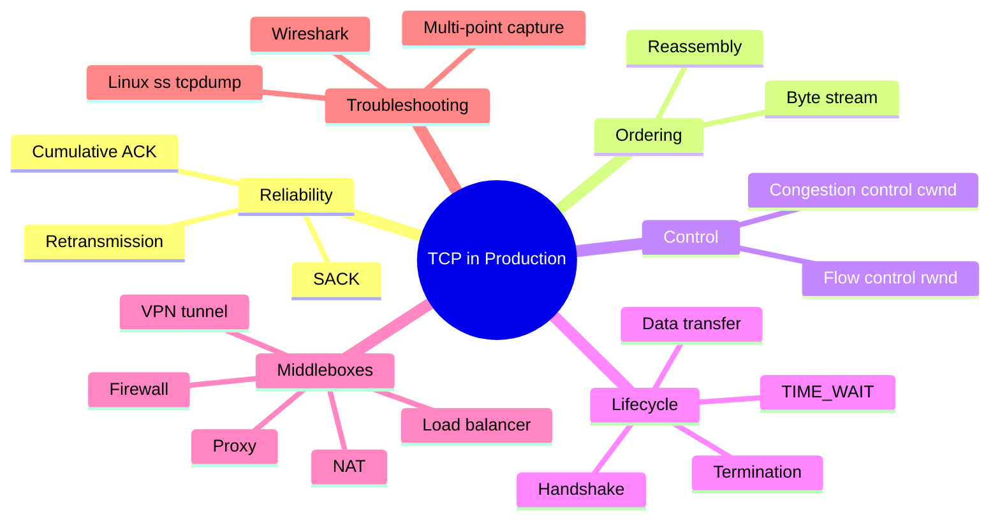

### 1.6 Misconceptions

- TCP is not message-based.
- Receive window is not an ACK frequency setting.
- High RTT does not imply packet loss.

### 1.7 Troubleshooting Questions

- Is the application stalled because of missing bytes, zero window, or app backpressure?
- Which device terminates TCP, and where does each TCP session start/end?
- Is observed retransmission from true loss, reordering, or capture artifact?

### 1.8 What I Should Remember

- TCP is a byte-stream reliability/control system over best-effort IP.
- Use tuple-based thinking and endpoint state, not single-packet guesses.

## 2. Encapsulation and Segmentation

### 2.1 Layers and Units

### Diagram 2: TCP/IP Encapsulation

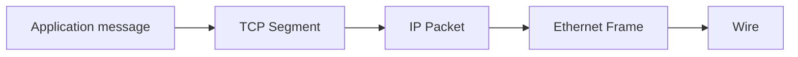

ASCII fallback:

```text
[Eth hdr][IP hdr][TCP hdr][App bytes]
```

- Segment: TCP unit.
- Packet: IP unit.
- Frame: L2 unit.
- Application message: app semantic unit, may span many TCP segments.

### 2.2 MTU, MSS, PMTUD, Fragmentation

- **MTU**: Max L3 payload on link.
- **MSS**: Max TCP payload per segment, usually negotiated in SYN.
- **PMTUD**: Learns path MTU using DF behavior and ICMP signaling.
- **IP fragmentation**: Generally undesirable for performance/reliability.
- **MSS clamping**: Middleboxes may rewrite MSS to avoid tunnel fragmentation.

### 2.3 Offload Effects

- **TSO/GSO** can make host captures show very large TCP segments before NIC segmentation.
- **GRO/LRO** can make receive-side captures show merged segments.
- This does not mean wire MTU was exceeded.

### 2.4 Production Scenario: VPN Tunnel MTU Black Hole

Symptom: HTTPS upload stalls at consistent byte offset.

Likely pattern:

- SYN/SYN-ACK succeeds.
- Small records pass.
- Larger payload causes repeated retransmissions of same sequence range.
- ICMP PTB blocked or absent, PMTUD fails.

Wireshark signs:

```wireshark
tcp.analysis.retransmission and tcp.stream eq N
```

### 2.5 What I Should Remember

- Encapsulation determines where size constraints apply.
- MTU/MSS/tunnel overhead mismatch often looks like random retransmission.

## 3. TCP Header in Depth

### Diagram 3: TCP Header Structure

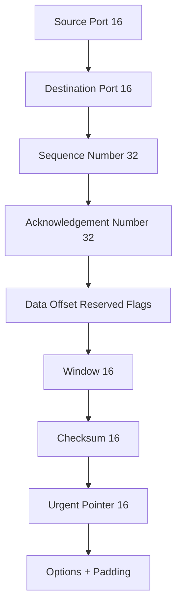

| Field | Purpose | Changes During Flow |
|---|---|---|
| Source/Destination Port | Socket demux | Fixed per direction for a connection |
| Sequence Number | Byte index of first payload byte | Increases by payload bytes (+1 for SYN/FIN) |
| Acknowledgement Number | Next expected byte from peer | Advances cumulatively |
| Data Offset | TCP header length | Increases with options |
| Flags | Control semantics | SYN/ACK/FIN/RST etc by phase |
| Window | Advertised receive capacity | Dynamic with receive buffer state |
| Checksum | End-to-end integrity | Recomputed each segment |
| Urgent Pointer | URG semantics | Rare in modern apps |
| Options | MSS, WS, SACK, TS, ECN | Most negotiated in SYN |

Flag combinations often seen:

- `SYN`
- `SYN,ACK`
- `ACK`
- `PSH,ACK` (common data carriage)
- `FIN,ACK`
- `RST` or `RST,ACK`

ECN-related flags:

- `ECE`, `CWR` during ECN-capable congestion signaling.
- `NS` may appear depending on stack support.

### 3.1 What I Should Remember

- Header fields are state projections, not independent toggles.
- Interpret flags with sequence/ack/window context.

## 4. Three-Way Handshake in Depth

### Mechanism, Need, and Activation

- **What**: 3-segment exchange to synchronize sequence spaces and negotiate options.
- **Why**: Validates bidirectional reachability and initializes byte-stream control variables.
- **When active**: Active open (`connect`) to passive open (`listen`).

### Diagram 4: Three-Way Handshake

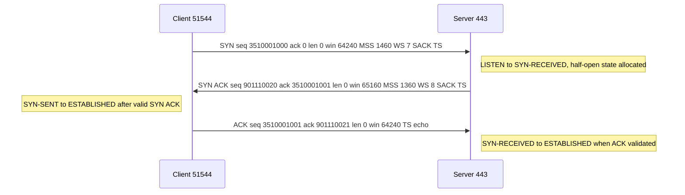

### Packet Table: Raw Sequence Numbers

| # | Src -> Dst | Flags | Seq | Ack | Len | Win | Options | Client state | Server state |
|---|---|---|---:|---:|---:|---:|---|---|---|
| 1 | C:51544 -> S:443 | SYN | 3510001000 | 0 | 0 | 64240 | MSS1460,WS7,SACK,TS | SYN-SENT | LISTEN |
| 2 | S:443 -> C:51544 | SYN,ACK | 901110020 | 3510001001 | 0 | 65160 | MSS1360,WS8,SACK,TS | SYN-SENT | SYN-RECEIVED |
| 3 | C:51544 -> S:443 | ACK | 3510001001 | 901110021 | 0 | 64240 | TS | ESTABLISHED | ESTABLISHED |

### Packet Table: Wireshark Relative Numbers

| # | Seq (rel) | Ack (rel) | Note |
|---|---:|---:|---|
| 1 | 0 | - | SYN consumes one sequence number |
| 2 | 0 | 1 | server SYN consumes one |
| 3 | 1 | 1 | first pure ACK |

### Queueing and Scaling Details

- **[COMMON]** listen queue, SYN backlog, and accept queue are distinct.
- **[OS-SPECIFIC]** exact queue mechanics differ by kernel and socket options.
- SYN retransmissions are timer-driven; counts/timeouts vary by implementation and policy.
- SYN cookies may protect under backlog pressure, with feature trade-offs.

Option negotiation clarification:

- MSS, Window Scale, SACK Permitted, and Timestamps are negotiated during SYN exchange.
- ECN capability signaling is negotiated through handshake flag semantics when enabled by endpoints and allowed by path devices.

Handshake edge cases:

- Simultaneous open: both endpoints can transition through `SYN-SENT` and `SYN-RECEIVED` before `ESTABLISHED`.
- Half-open connections: one side believes established while the other has dropped state.
- SYN timeout behavior depends on implementation retransmission/backoff policy.

### Middlebox Effects

- Firewall/NAT create state on SYN; stale state can produce unexpected ACK/RST patterns.
- L4 load balancers may source-NAT or proxy, creating separate backend TCP sessions.
- Asymmetric routing may drop or invalidate return-path packets, breaking handshake completion.

### Abnormal Patterns

- SYN no response -> drop/filter/path issue.
- SYN -> RST -> no listener/policy reset/stale state mismatch.
- SYN -> ACK (no SYN) can indicate stale state in server/middlebox; client typically answers RST.

Wireshark filters:

```wireshark
tcp.flags.syn==1
tcp.flags.reset==1
tcp.flags.ack==1 and tcp.flags.syn==0 and tcp.len==0
```

### 4.1 What I Should Remember

- SYN and FIN consume sequence space.
- Handshake negotiates options like MSS/WS/SACK-perm/TS; ACK frequency is not negotiated via window field.

## 5. Sequence and Acknowledgement Numbers

### Core Rules

- Sequence number = first payload byte index in that segment.
- ACK = next expected byte from peer (cumulative).
- Duplicate ACKs usually repeat same ACK value while indicating holes and possibly SACK ranges.

### Diagram 5: Data Transfer with Sequence/Ack

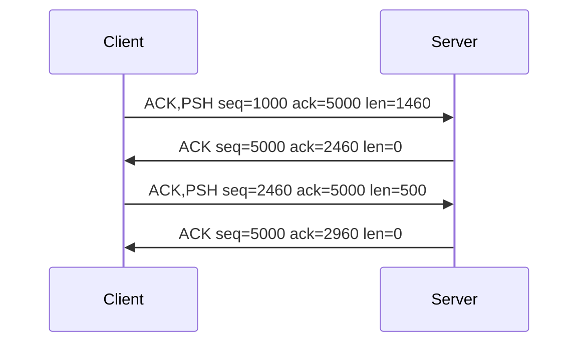

### Worked Calculation 1

- Starting sequence: 1000
- Payload: 1460 bytes
- Next expected by receiver: 2460
- Receiver sends ACK=2460

### Worked Calculation 2 (ACKing multiple segments)

- Received: `seq=1000 len=1000`, `seq=2000 len=1000`, `seq=3000 len=500`
- Receiver may send one cumulative ACK=3500.
- One ACK confirms multiple segments.

### Worked Calculation 3 (FIN consumption)

- Last data byte index sent: 9999
- Sender transmits FIN with `seq=10000` and `len=0`.
- Peer ACKs `10001` because FIN consumes one sequence number.

### Diagram 6: Cumulative Acknowledgement

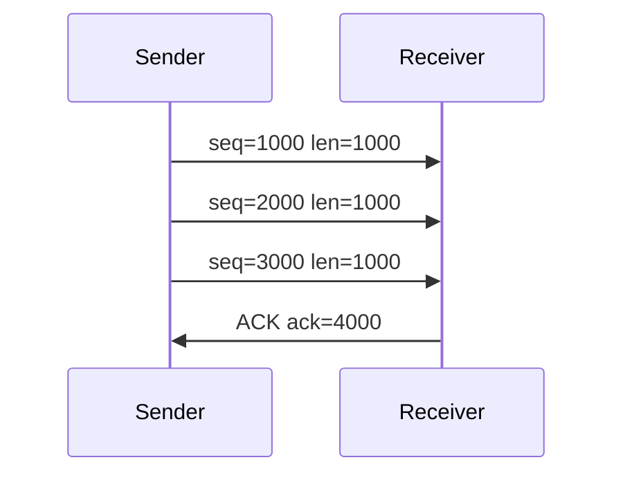

### 5.1 What I Should Remember

- ACK numbers are byte-oriented and cumulative.
- Packet count intuition causes errors; always compute by byte ranges.

## 6. ACK Strategies

### Distinctions

- Cumulative ACK: mandatory semantics.
- Delayed ACK: timing policy for ACK emission.
- Duplicate ACK: repeated ACK number, often indicates out-of-order/loss evidence.
- Duplicate ACKs normally repeat the same next-expected-byte value in the cumulative ACK field.
- SACK: optional blocks reporting non-contiguous received ranges; cumulative ACK remains authoritative.
- ACK thinning: middlebox behavior that reduces ACK cadence in transit; can alter sender dynamics.
- ACK compression: path queueing behavior that bunches ACK arrivals and can trigger bursty sender output.

### Diagram 7: Delayed ACK

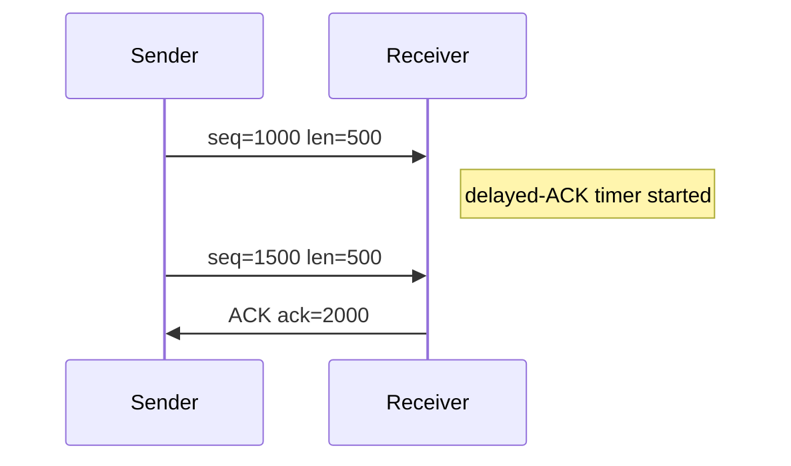

Scenario: last segment of burst lost, no later data arrives.

- No out-of-order arrivals beyond the hole.
- Duplicate ACK evidence may be absent.
- Sender commonly relies on RTO to retransmit missing tail segment.

Misconception correction:

- "ACK every 8 packets" is not generally negotiated by the TCP window field.
- ACK cadence and receive-window advertisement are separate mechanisms.

### 6.1 What I Should Remember

- Duplicate ACK-based fast retransmit needs evidence from later arrivals.
- No evidence often means timeout-based recovery.

## 7. Sliding Window and Receiver Flow Control

### Diagram 8: Sliding Receive Window

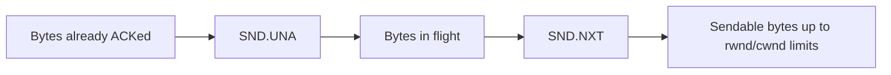

### Diagram 9: Receiver Flow Control

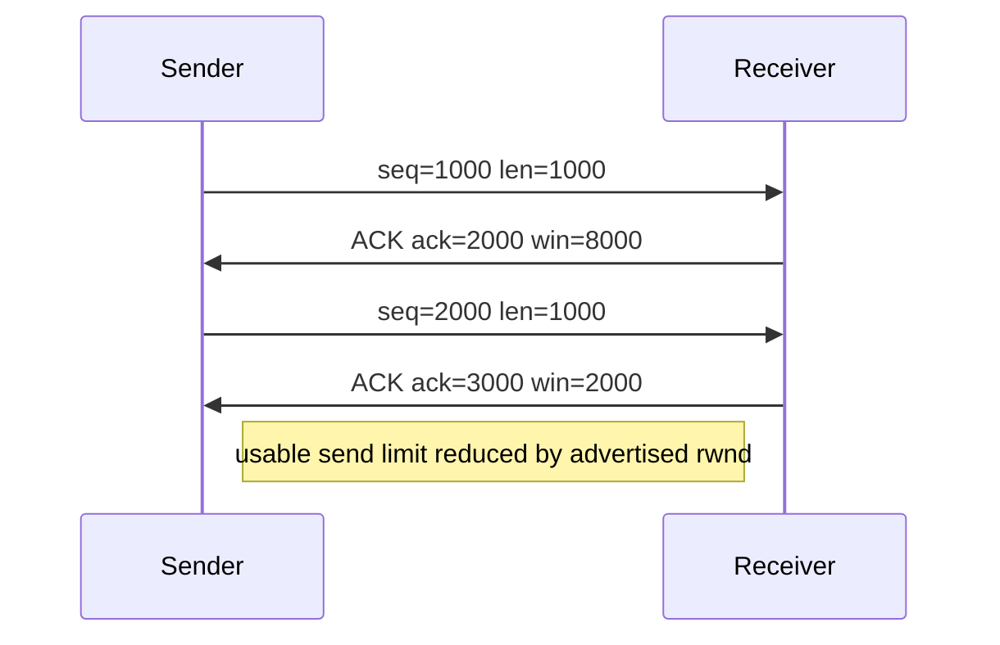

### Variables and Sender Limit

- `rwnd`: receiver-advertised available bytes.
- `cwnd`: congestion-control sending limit.
- Effective sender window approximately `min(rwnd, cwnd)` minus bytes already in flight.
- Receive window is receiver capacity advertisement, not an ACK frequency control.

### Diagram 10: Zero Window and Window Probe Recovery

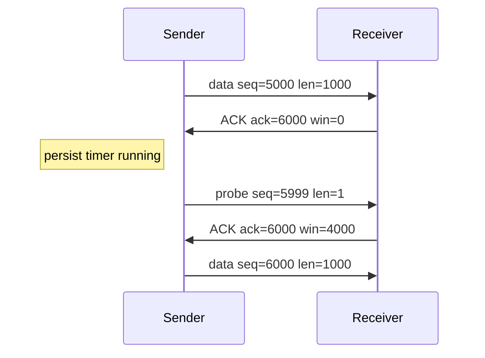

### Nagle, Delayed ACK, SWS

- Nagle may coalesce small writes until ACKed data exists.
- Delayed ACK may defer ACK transmission briefly.
- Their interaction can create latency for tiny request/response patterns.
- Clark's solution and receiver policies aim to reduce tiny window advertisements.

Analogy (and limit):

- Room-and-door analogy: room size = receive buffer, door opening = advertised window.
- Not accurate for congestion dynamics, selective ACK details, or timer behavior.

### 7.1 What I Should Remember

- Flow control protects receiver memory.
- Congestion control protects the network; related but distinct.

## 8. Window Scaling and Bandwidth-Delay Product

### Diagram Context

- 16-bit window field max unscaled value: 65,535.
- Window scale option negotiated only in SYN/SYN-ACK.

### Effective Window Formula

- Advertised field value: `W`.
- Scale shift: `S`.
- Effective receive window: `W * 2^S` bytes.

### BDP Calculations

1. **100 Mbps, RTT 100 ms**
   - Bandwidth = 100,000,000 bps = 12,500,000 B/s
   - RTT = 0.1 s
   - BDP = 1,250,000 B (~1.19 MiB)

2. **1 Gbps, RTT 50 ms**
   - Bandwidth = 1,000,000,000 bps = 125,000,000 B/s
   - RTT = 0.05 s
   - BDP = 6,250,000 B (~5.96 MiB)

3. **VPN high-latency example: 200 Mbps, RTT 180 ms**
   - 200 Mbps = 25,000,000 B/s
   - BDP = 4,500,000 B (~4.29 MiB)

If effective receive window is far below BDP, throughput is receive-window-limited.

### 8.1 What I Should Remember

- Window scaling increases representable receive window, not per-segment payload size.
- High-BDP paths need sufficient rwnd and compatible sender behavior.

## 9. RTT and TCP Timers

### Timer Model

- **[SPEC/COMMON]** RTO uses smoothed RTT and RTT variation concepts.
- **[COMMON]** exponential backoff after retransmission timeouts.
- **[SPEC]** Karn-style behavior avoids ambiguous RTT sampling on retransmitted data.

Timers to know:

- Retransmission timer (RTO)
- Delayed ACK timer
- Persist timer
- Keepalive timer (if enabled)
- TIME_WAIT duration control (OS policy around 2xMSL concept)
- Application-level timeout (separate from TCP)

No universal fixed values. They vary by OS/kernel/version/configuration/network conditions.

Linux inspection examples:

```bash
sysctl net.ipv4.tcp_fin_timeout
sysctl net.ipv4.tcp_keepalive_time
sysctl net.ipv4.tcp_keepalive_intvl
sysctl net.ipv4.tcp_keepalive_probes
ss -ti dst <peer-ip>
```

### 9.1 What I Should Remember

- TCP timeout behavior is adaptive and implementation-dependent.
- Always separate transport timer behavior from application timeout behavior.

## 10. Packet Loss and Retransmission

### Diagram 11: Packet Loss with Duplicate ACKs

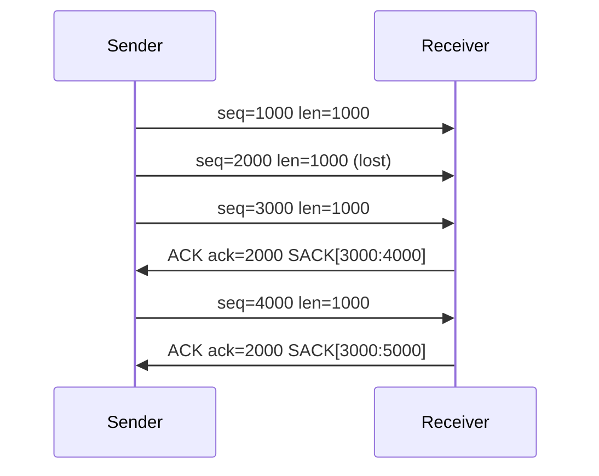

### Diagram 12: Fast Retransmit

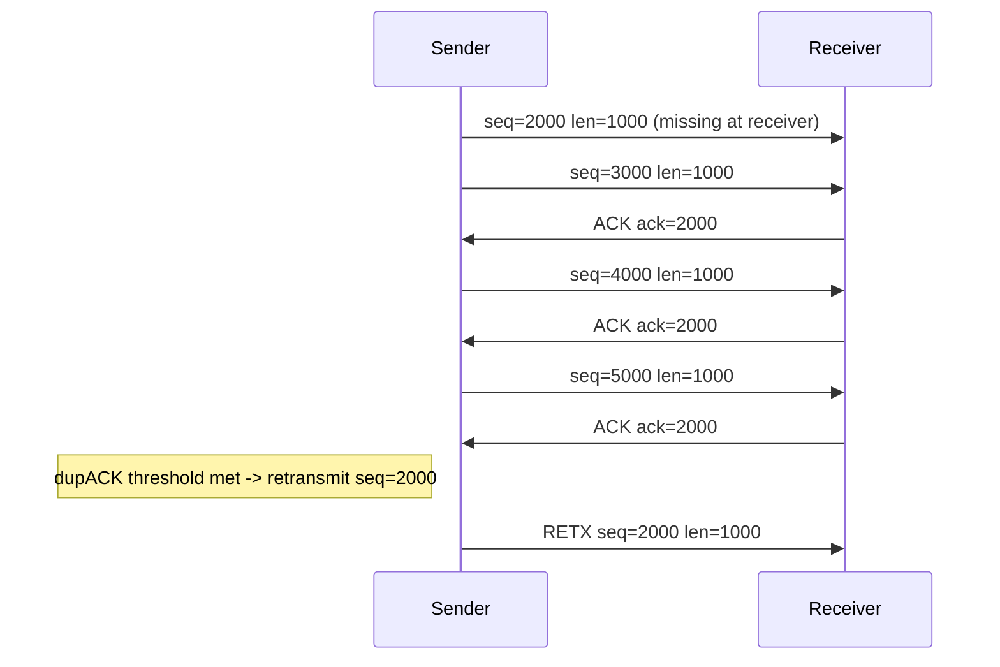

### Diagram 13: SACK Recovery

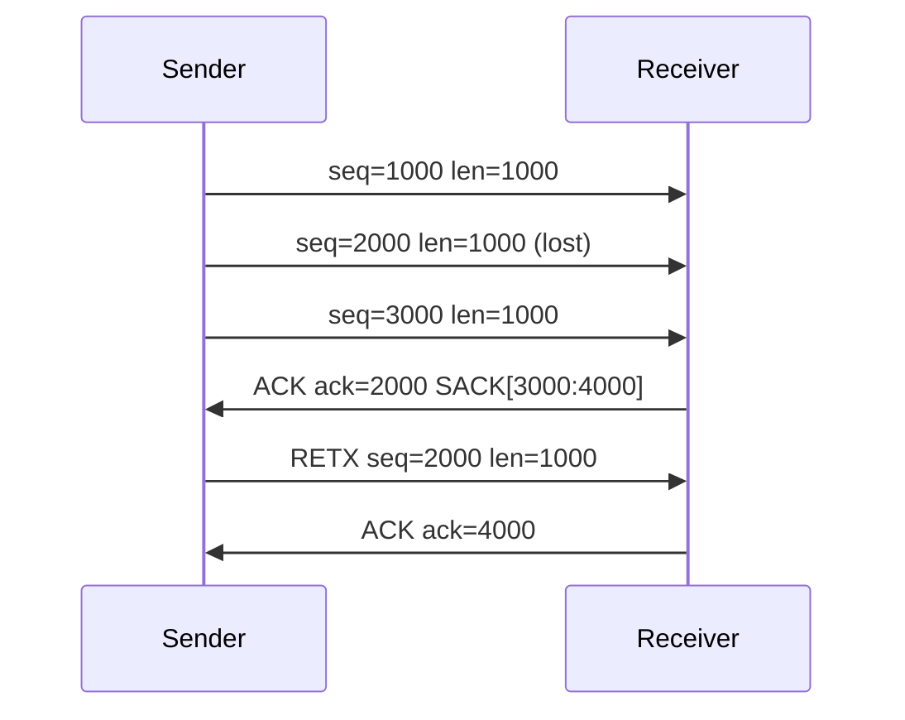

### Diagram 14: RTO-Based Recovery

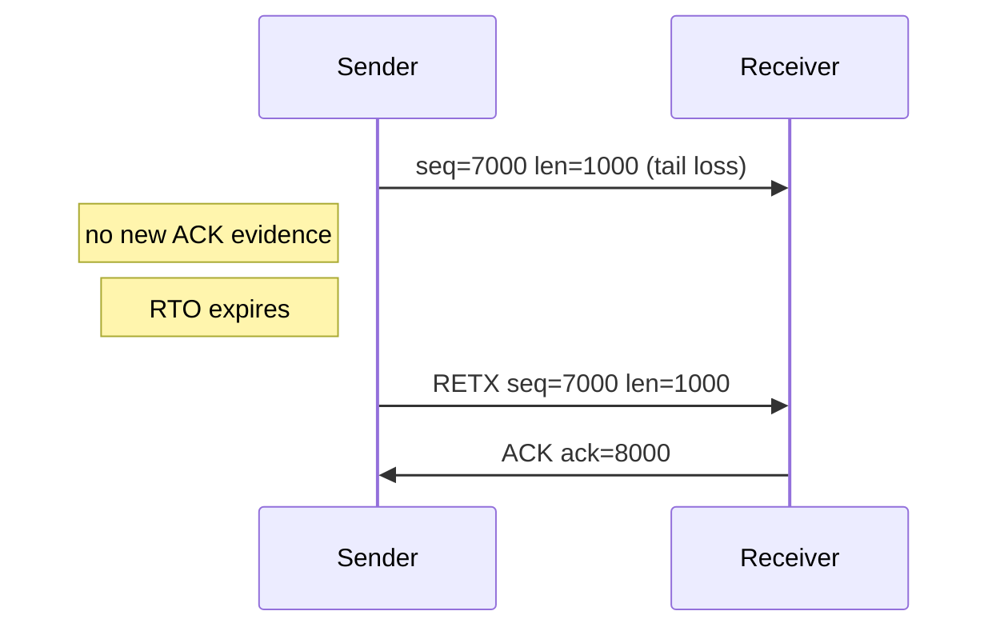

### Scenario Matrix

| Scenario | Receiver ACK behavior | Sender inference | Recovery trigger | Congestion proof? |
|---|---|---|---|---|
| Middle segment lost | Repeated ACK same value, maybe SACK holes | Missing range detected | Fast retransmit or RTO | Not always |
| Last segment lost | May not generate dupACKs | No positive evidence | RTO or TLP-like mechanism | Not always |
| ACK lost | Later cumulative ACK may cover data | Data might still be delivered | Possibly none | No |
| Reordering | Temporary dupACK/out-of-order | Ambiguous | Usually self-heals | No |
| Retransmission also lost | Continued hole | persistent loss/path issue | further timer/recovery logic | Maybe |
| DSACK evidence | ACK includes duplicate SACK block for already received data | prior retransmit may have been unnecessary | sender may adjust reordering assumptions | No |
| Tail loss probe style recovery | no dupACK evidence yet | sender probes near tail before full timeout (if implementation supports) | TLP timer path | Not by itself |

Extended scenario table with byte ranges:

| Scenario | Example byte ranges | Receiver reply | Sender belief | Timer behavior | Exact retransmit range |
|---|---|---|---|---|---|
| ACK lost | Sent `1000-1999`, ACK `2000` lost, later ACK `3000` arrives | ACK jumps to 3000 | Earlier data likely delivered | RTO may be canceled by later ACK | None required if later cumulative ACK covers |
| Multiple consecutive losses | Missing `2000-2999` and `3000-3999` | Repeated ACK `2000`, SACK maybe `[4000:5000]` | Multiple holes or broad loss event | Fast recovery may start, RTO may still be needed | `2000-3999` (algorithm-dependent pacing) |
| Reordering only | `3000-3999` arrives before `2000-2999` | DupACK `2000`, then ACK advances once gap fills | Ambiguous: loss vs reorder | Often no timeout if reordered segment arrives quickly | Often none |
| Spurious retransmission | Original `5000-5999` delivered, delayed ACK path triggers resend | ACK already beyond retransmitted range | Sender had stale/late signal | Timers may have fired prematurely | `5000-5999` resent unnecessarily |
| Delayed-ACK interaction | Small writes and delayed ACK defer feedback | ACK timing appears sparse | Sender may infer slower progression | No loss timer necessarily | None unless RTO falsely triggered |

Production scenario:

- WAN path with transient queue burst reorders packets but drops none.
- Single capture point shows duplicate ACK and apparent retransmission.
- Parallel capture near receiver confirms reordered arrival and eventual in-order assembly.
- Conclusion: not definitive congestion proof.

Wireshark useful filters:

```wireshark
tcp.analysis.retransmission
tcp.analysis.fast_retransmission
tcp.analysis.spurious_retransmission
tcp.analysis.duplicate_ack
tcp.analysis.out_of_order
tcp.options.sack
```

### 10.1 What I Should Remember

- Not every loss creates duplicate ACKs.
- Fast retransmit needs later arrivals as evidence; tail losses often need timeout-style recovery.

## 11. Congestion Control

### Core Variables

- `cwnd`: sender-side congestion window.
- `rwnd`: receiver-advertised flow control window.
- Flight size: bytes sent but not cumulatively ACKed.
- Effective send cap: roughly `min(cwnd, rwnd)`.

### Diagram 15: Slow Start and Congestion Avoidance

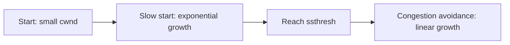

### Diagram 16: cwnd Reduction After Loss

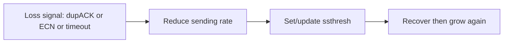

Conceptual family comparison:

| Algorithm | Growth style | Loss response style | Notes |
|---|---|---|---|
| Reno | AIMD | Fast retransmit/recovery, timeout fallback | Classical baseline |
| NewReno | Reno + better partial ACK handling | Improved multiple-loss behavior | Widely taught |
| CUBIC | Cubic growth function | Different probing dynamics | Common on Linux |
| BBR | Model-based pacing | Not strictly loss-driven like Reno/CUBIC | Behavior differs by version |

Educational round example (not universal packet counts):

- RTT1 `cwnd=10 MSS`, RTT2 `20`, RTT3 `40`, loss at RTT4, reduce to policy-specific lower value, then recover.

Misconception correction:

- DHCP is not part of TCP slow start. DHCP is separate host configuration traffic, not transport congestion-window growth logic for an existing TCP flow.

### 11.1 What I Should Remember

- Flow control and congestion control are different control loops.
- Packet loss can mean congestion, but may also result from policy drops, corruption, or reordering artifacts.

## 12. Connection Termination

### Diagram 17: Graceful Four-Segment Termination

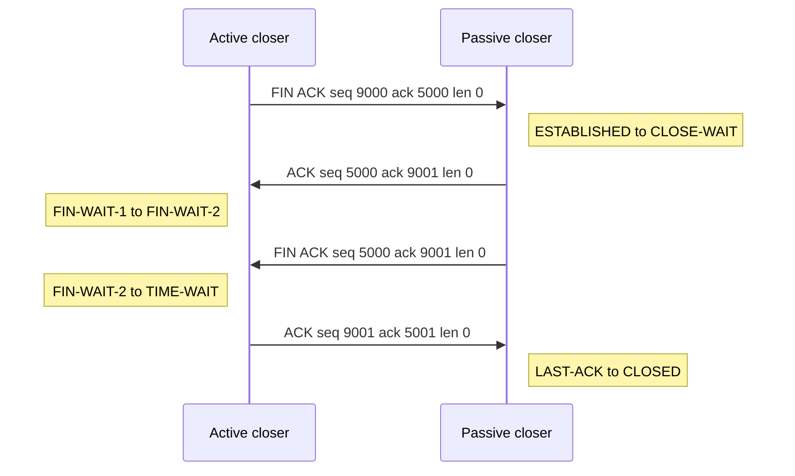

### Diagram 20: Half-Close Scenario

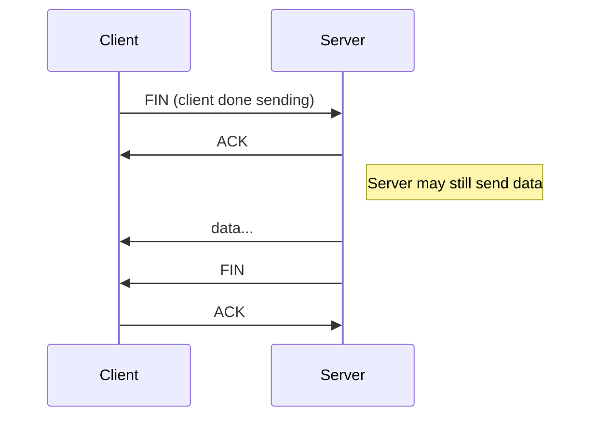

### Diagram 21: Connection Reset Scenario

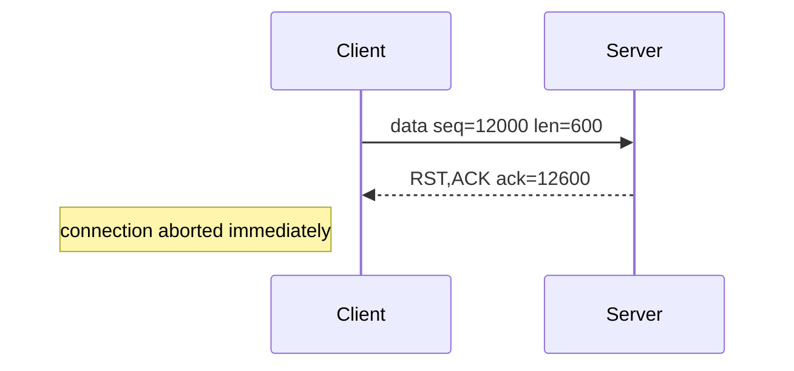

Key points:

- FIN is orderly close semantics.
- RST is abrupt abort semantics.
- `shutdown()` and `close()` behavior is application and OS API dependent.

### 12.1 What I Should Remember

- Active closer commonly enters TIME_WAIT after final ACK.
- FIN paths and RST paths have different implications for buffered data and application behavior.

## 13. TCP State Machine

### Diagram 18: TCP State Machine

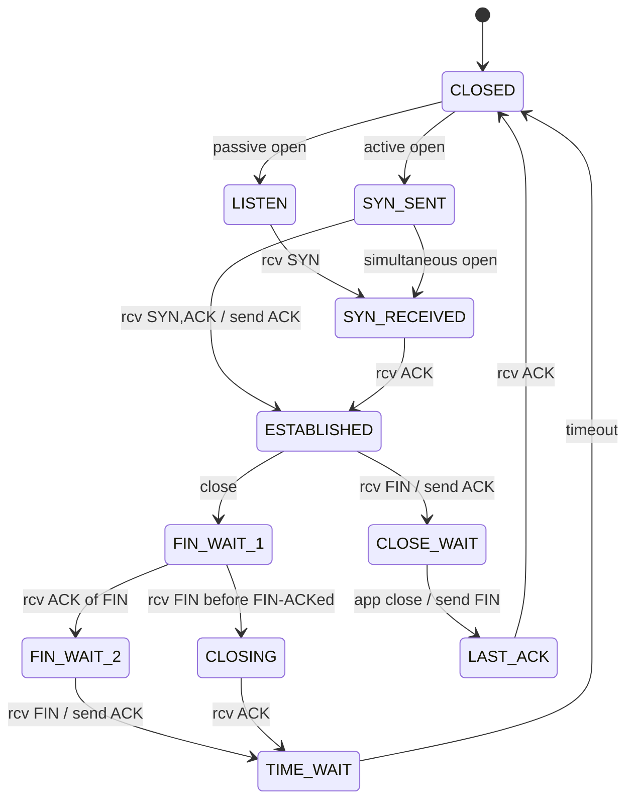

State quick table:

| State | Entered by | Trigger | Common issue | Linux visibility |
|---|---|---|---|---|
| LISTEN | Server | passive open | backlog pressure | `ss -ltn` |
| SYN-SENT | Client | active open | no SYN-ACK | `ss -tan state syn-sent` |
| SYN-RECEIVED | Server | SYN seen | half-open buildup | `ss -tan state syn-recv` |
| ESTABLISHED | Both | handshake complete | stalls/retransmissions | `ss -ti` |
| FIN-WAIT-1/2 | Active closer | close path | peer not closing | `ss -tan state fin-wait-1` |
| CLOSE-WAIT | Passive closer | FIN received | app not closing socket | `ss -tan state close-wait` |
| LAST-ACK | Passive closer | FIN sent awaiting ACK | ACK blocked/lost | `ss -tan state last-ack` |
| TIME-WAIT | Usually active closer | final ACK sent | high count concern | `ss -tan state time-wait` |

### 13.1 What I Should Remember

- States are protocol states, not interchangeable timers.
- CLOSE_WAIT often indicates application close handling defect.

## 14. TIME_WAIT, CLOSE_WAIT and Stale Sessions

### Diagram 19: TIME_WAIT Scenario

```mermaid
sequenceDiagram
	participant C as Client(active close)
	participant S as Server
	C->>S: FIN
	S->>C: ACK
	S->>C: FIN
	C->>S: ACK
	Note left of C: enters TIME_WAIT (2xMSL concept)
```

Important accuracy points:

- TIME_WAIT is usually on active closer, but simultaneous close and implementation specifics exist.
- MSL is protocol concept, not dynamically measured per connection.
- High TIME_WAIT may be normal for short-lived high-rate connections.

Production case pattern required by prompt:

1. Client/VPN gateway reuses a recent source port.
2. Backend or middlebox still has stale state and replies unexpectedly (e.g., pure ACK or invalid state response).
3. Initiator sends RST, but firewall blocks that RST.
4. New establishment succeeds only after stale state expires.

Troubleshooting:

- Capture both sides of firewall and at backend.
- Compare tuple reuse timing and session timeout tables.
- Validate whether reset packet traverses policy path.

### 14.1 What I Should Remember

- TIME_WAIT protects correctness; it is not inherently bad.
- CLOSE_WAIT points at local application behavior, not network congestion.

## 15. TCP Resets

Common RST causes:

- No listener / connection refused.
- Packet invalid for current state.
- Application abort.
- Middlebox-generated policy reset.
- Idle timeout state drop followed by unexpected packet.

Attribution techniques:

- TTL differences from expected host profile.
- IP ID/DF pattern consistency.
- L2 MAC origin in same broadcast domain.
- Parallel captures across hops.
- Seq/Ack validity against expected socket state.

### 15.1 What I Should Remember

- Do not assume endpoint generated the RST just because source IP matches.
- Multi-point capture is the fastest way to prove origin.

## 16. Keepalive and Idle Sessions

Different mechanisms:

- TCP keepalive: transport probe mechanism, usually long idle defaults.
- Application keepalive: protocol-level heartbeats.
- HTTP keep-alive: connection reuse semantics, not TCP keepalive timer.
- VPN keepalive: tunnel/session liveness mechanism.

Middlebox interactions:

- NAT/firewall/LB idle timers can expire earlier than endpoint expectations.
- Endpoint may think session is ESTABLISHED while middlebox has removed state.

### 16.1 What I Should Remember

- Keepalive names are overloaded; always specify layer and mechanism.

## 17. Production Devices and TCP

### Diagram 22: NAT/Firewall/Load-Balancer Path

```mermaid
flowchart LR
	C[Client] --> FW[Stateful Firewall]
	FW --> NAT[NAT/PAT]
	NAT --> LB[Load Balancer]
	LB --> WAF[WAF/Proxy]
	WAF --> S[Backend Server]
```

| Device | Pass-through / Terminate / Proxy | TCP sessions created | Seq number continuity | Common issue |
|---|---|---|---|---|
| Stateful firewall | Pass-through with state | Usually one end-to-end | Preserved | Idle timeout mismatch |
| NAT/PAT | Pass-through with tuple rewrite | One logical end-to-end, translated tuple | Preserved payload seq | Port exhaustion/stale mapping |
| VPN gateway | Tunnel endpoint; may proxy app path | Outer tunnel and inner sessions | Depends on role | MTU/MSS overhead issues |
| Reverse proxy | Terminates client TCP and opens backend TCP | Two sessions | Different per leg | Timeout asymmetry |
| Forward proxy | Similar split for outbound traffic | Two sessions | Different per leg | Auth/proxy buffering effects |
| Load balancer | Pass-through or proxy mode | One or two sessions | May differ in full proxy | Idle reset or source NAT visibility |
| IDS/IPS | Inline inspect/reset policy | Usually pass-through + policy actions | Preserved unless reset injection | False positive resets |
| WAN optimizer | May proxy/shape | Often split | Different per leg | Reordering/pacing artifacts |
| Linux host | Endpoint stack | Endpoint session | Native | Offload visibility confusion |
| Containers/K8s | Overlay/NAT/proxy hops | Multiple hidden legs | Often transformed | conntrack timeout mismatch |

Capture guidance:

- Capture at both endpoints plus one middlebox edge when possible.
- For proxies/LBs, inspect each leg separately.

### Stateful Firewall

- Usually passes TCP while tracking state and applying policy.
- Session timeout mismatch is common in long-idle enterprise apps.

### NAT and PAT

- Rewrites source/destination tuples while forwarding payload.
- Source port reuse and mapping expiration are frequent production fault triggers.

### VPN Gateway

- Adds tunnel overhead and may terminate one session while forwarding another.
- MTU/MSS handling is critical.

### Reverse Proxy

- Terminates client TCP and opens backend TCP.
- Frontend and backend sequence spaces are independent.

### Forward Proxy

- Similar split behavior for outbound enterprise traffic.
- Authentication and buffering can alter observed timing.

### Load Balancer

- In full-proxy mode, TCP legs are separate; in pass-through mode, they are not.
- Idle timeout mismatch frequently causes post-idle reset/drop symptoms.

### Web Application Firewall

- Often acts as L7 proxy; may close backend leg differently from client leg.
- Inspect both sides for causality.

### IDS/IPS

- May pass-through or inject resets on policy match.
- RST attribution must include TTL/IPID/MAC and capture placement.

### WAN Optimizer

- Can split/shape transport behavior and change pacing/reordering profile.

### Linux Server

- Endpoint TCP behavior controlled by kernel version/configuration and socket options.
- Use `ss -ti`, `nstat`, and pcap together.

### Container and Kubernetes Networking

- Overlay, NodePort, kube-proxy, and conntrack can introduce extra stateful hops.
- Capture may be needed in pod namespace, node interface, and edge device.

### 17.1 What I Should Remember

- TCP may be split into multiple independent sessions by proxies and LBs.
- Sequence numbers are only comparable within the same TCP leg.

## 18. TLS over TCP

TCP handshake happens before TLS handshake bytes.

- TLS records can span multiple TCP segments.
- TCP segments can contain partial or multiple TLS records.
- Retransmission during TLS handshake indicates transport recovery, not automatic TLS failure.

HTTPS full flow (high level):

1. DNS query/response.
2. TCP 3-way handshake to server/LB.
3. TLS ClientHello (possibly split).
4. TLS ServerHello and cert chain records.
5. Key exchange / Finished.
6. HTTP request/response.
7. TCP close (FIN or occasionally RST).

Packet-flow view:

```mermaid
sequenceDiagram
	participant C as Client
	participant D as DNS Server
	participant E as HTTPS Endpoint
	C->>D: DNS query A/AAAA for service.example
	D->>C: DNS response IP=203.0.113.10
	C->>E: SYN src=51544 dst=443 seq=100000 win=64240 options=MSS,WS,SACK,TS
	E->>C: SYN,ACK seq=700000 ack=100001 win=65160 options=MSS,WS,SACK,TS
	C->>E: ACK seq=100001 ack=700001
	C->>E: TLS ClientHello (may span multiple segments)
	E->>C: TLS ServerHello/Certificate/Finished (segmented as needed)
	C->>E: TLS Finished
	C->>E: HTTP request bytes
	E->>C: HTTP response bytes
	C->>E: FIN,ACK
	E->>C: ACK
	E->>C: FIN,ACK
	C->>E: ACK
```

### 18.1 What I Should Remember

- Start with TCP correctness before debugging TLS semantics.

## 19. Wireshark Analysis

Practical focus points:

- Follow TCP Stream
- Relative sequence numbers
- Expert Info (with caution)
- Stream index isolation
- Conversation statistics
- RTT graphs and ACK RTT
- Window scaling and calculated window
- Bytes in flight
- Keepalive and Keepalive ACK behavior
- "Previous segment not captured" warnings
- Port reuse indicators

Common filters:

```wireshark
tcp
tcp.stream eq N
tcp.flags.syn == 1
tcp.flags.fin == 1
tcp.flags.reset == 1
tcp.analysis.retransmission
tcp.analysis.fast_retransmission
tcp.analysis.duplicate_ack
tcp.analysis.out_of_order
tcp.analysis.zero_window
tcp.analysis.window_full
tcp.analysis.window_update
tcp.analysis.bytes_in_flight
tcp.options.wscale.shift
tcp.options.sack_perm
tcp.options.sack
tcp.time_delta
tcp.analysis.ack_rtt
tcp.analysis.keep_alive
tcp.analysis.keep_alive_ack
tcp.analysis.lost_segment
tcp.analysis.duplicate_ack
```

Limitations:

- Capture loss and mirror-port drops.
- Single-point captures hide other path behavior.
- Offload can distort host-capture interpretation.
- Asymmetric routing can make one direction invisible.
- Reordering can be mis-flagged as retransmission patterns.

### 19.1 What I Should Remember

- Wireshark flags are hints, not proof.
- Correlate with topology, timing, and multi-point evidence.

## 20. Linux Troubleshooting

Useful commands:

```bash
ss -ltn
ss -tan state established
ss -tan state time-wait
ss -tan state close-wait
ss -ti dst <peer-ip>
ip -br a
ip route get <peer-ip>
tcpdump -i any -nnvvv tcp and host <peer-ip>
tshark -r capture.pcapng -Y "tcp.stream eq 5"
ethtool -k <iface>
sysctl -a | grep '^net.ipv4.tcp_'
nstat -az | egrep 'Tcp|IpExt'
netstat -s
cat /proc/net/tcp
```

Inspection goals:

- Socket states and owning process (`ss -tanp`).
- Retransmission statistics and congestion algorithm.
- Keepalive/timestamps/SACK/window scaling settings.
- Offload status for capture interpretation.

Risk note:

- Do not change kernel parameters in production without scope, rollback, and validation plan.

### 20.1 What I Should Remember

- Linux has excellent visibility if you correlate socket state, counters, and pcap timeline.

## 21. Troubleshooting Methodology

Repeatable workflow:

1. Define user-visible symptom.
2. Map every hop and identify TCP termination points.
3. Collect simultaneous captures.
4. Isolate stream and validate handshake.
5. Validate options and window scaling.
6. Track seq/ack evolution and bytes in flight.
7. Identify retransmission/reordering/zero-window.
8. Validate closure path FIN/RST.
9. Correlate with middlebox session timers.
10. Compare failing vs working stream.
11. Separate evidence from assumption.
12. Validate root-cause hypothesis safely.

### Diagram 23: TCP Troubleshooting Decision Tree

```mermaid
flowchart TD
	A[Symptom observed] --> B{Handshake complete?}
	B -- No --> C{SYN response?}
	C -- None --> C1[Check drop path, ACL, routing, capture both ends]
	C -- RST --> C2[No listener, policy reset, stale state]
	C -- ACK-only --> C3[Possible stale state or asymmetric path]
	B -- Yes --> D{Data progresses?}
	D -- No --> E{Zero window?}
	E -- Yes --> E1[Receiver/app backpressure; inspect buffers]
	E -- No --> F{Retransmissions?}
	F -- Yes --> F1[Loss/reorder/MTU/policy path analysis]
	F -- No --> G[App-layer stall or dependency wait]
	D -- Yes --> H{Unexpected RST/timeout?}
	H -- Yes --> H1[Idle timeout mismatch, stale session, policy reset]
	H -- No --> I[Likely normal TCP behavior]
```

### 21.1 What I Should Remember

- A method beats intuition. Evidence first, assumptions second.

## 22. Complete Production Case Studies

Each case includes topology, symptom, expected/actual flow, key fields, filters, and validation.

### Case 1: Firewall silently dropping SYN

| Field | Detail |
|---|---|
| Topology | Client -> Stateful Firewall -> Server |
| User-visible symptom | Connect timeout |
| Expected flow | SYN -> SYN-ACK -> ACK |
| Actual flow | Repeated SYN retries, no SYN-ACK |
| Packet timeline | t0 SYN, t1/t2 SYN retries with backoff |
| Key TCP fields | SYN flag, increasing retry intervals |
| Wireshark filter | `tcp.flags.syn==1 and tcp.stream eq N` |
| Evidence | SYN seen client-side, absent server-side |
| Possible causes | ACL drop, route blackhole, asymmetric policy path |
| How to distinguish the causes | Compare captures on both firewall interfaces and route tables |
| Recommended next capture point | Server-facing firewall interface |
| Safe validation steps | Temporary permit rule for test tuple with rollback |
| Final learning point | No SYN-ACK usually means drop/path issue, not app error |

### Case 2: Server actively refusing with RST

| Field | Detail |
|---|---|
| Topology | Client -> Firewall -> Server |
| User-visible symptom | Immediate connection refused |
| Expected flow | SYN -> SYN-ACK |
| Actual flow | SYN -> RST (or RST,ACK) |
| Packet timeline | t0 SYN, t0+RTT RST |
| Key TCP fields | RST with ack of SYN+1 often present |
| Wireshark filter | `tcp.flags.reset==1 and tcp.stream eq N` |
| Evidence | RST source IP/TTL matches server profile |
| Possible causes | No listener, closed port policy, host stack reject |
| How to distinguish the causes | Check server `ss -ltn` and local firewall logs |
| Recommended next capture point | Server NIC capture |
| Safe validation steps | Start temporary listener on target port |
| Final learning point | RST is active refusal, not packet loss |

### Case 3: Asymmetric routing during handshake

| Field | Detail |
|---|---|
| Topology | Client -> FW1 -> Server, return via FW2 |
| User-visible symptom | SYN retries despite reachable server |
| Expected flow | Symmetric SYN/SYN-ACK/ACK |
| Actual flow | Server sends SYN-ACK, client never receives |
| Packet timeline | SYN arrives server, SYN-ACK exits alternate path |
| Key TCP fields | Repeated SYN from client, no ACK completion |
| Wireshark filter | `tcp.flags.syn==1 or tcp.flags.ack==1` with stream filter |
| Evidence | SYN-ACK visible server-side only |
| Possible causes | Asymmetric routing, policy drop on return path |
| How to distinguish the causes | Traceroute/flow logs and dual-edge captures |
| Recommended next capture point | Return-path firewall/router egress |
| Safe validation steps | Policy-based route pinning for test flow |
| Final learning point | Handshake requires bidirectional path validity |

### Case 4: MTU black hole over VPN

| Field | Detail |
|---|---|
| Topology | Client -> VPN gateway -> Internet/VPN -> Server |
| User-visible symptom | Large transfers stall; small requests succeed |
| Expected flow | Continuous ACK progression |
| Actual flow | Repeated retransmit at same high sequence range |
| Packet timeline | Handshake OK, data starts, tail/mid-range retransmits repeat |
| Key TCP fields | MSS values, repeated seq range, no advancing ACK |
| Wireshark filter | `tcp.analysis.retransmission and tcp.stream eq N` |
| Evidence | Loss begins near payload sizes exceeding effective path MTU |
| Possible causes | PMTUD failure, ICMP blocked, missing MSS clamp |
| How to distinguish the causes | Compare with smaller MSS test stream |
| Recommended next capture point | VPN inside and outside interfaces |
| Safe validation steps | Controlled MSS clamp change and rollback |
| Final learning point | Tunnel overhead can reduce effective MTU enough to break flows |

### Case 5: Receiver zero window

| Field | Detail |
|---|---|
| Topology | Sender -> Receiver application server |
| User-visible symptom | Throughput pauses then resumes intermittently |
| Expected flow | Positive receive window with steady ACK progress |
| Actual flow | ACK advertises win=0, sender probes later |
| Packet timeline | Data burst -> win 0 -> probe -> window update |
| Key TCP fields | Window field 0, probe seq, subsequent win update |
| Wireshark filter | `tcp.analysis.zero_window or tcp.analysis.window_update` |
| Evidence | Receiver repeatedly advertises no space |
| Possible causes | Application slow-read, receive buffer pressure |
| How to distinguish the causes | Host socket memory and app consumption metrics |
| Recommended next capture point | Receiver host capture and app metrics node |
| Safe validation steps | Rate-limit sender in test, profile receiver read path |
| Final learning point | Flow control protects receiver; not a congestion verdict |

### Case 6: Middle segment loss with fast retransmit

| Field | Detail |
|---|---|
| Topology | Sender -> WAN -> Receiver |
| User-visible symptom | Short jitter spike, then recovery |
| Expected flow | ACK advances each segment |
| Actual flow | DupACK train for missing byte range, fast retransmit |
| Packet timeline | Missing middle segment followed by later arrivals |
| Key TCP fields | Repeated ACK value, optional SACK blocks |
| Wireshark filter | `tcp.analysis.duplicate_ack or tcp.analysis.fast_retransmission` |
| Evidence | Later segments arrived and generated duplicate ACK evidence |
| Possible causes | Real loss or severe reorder |
| How to distinguish the causes | Compare parallel capture near receiver for reorder proof |
| Recommended next capture point | Receiver-side edge switch/SPAN |
| Safe validation steps | Verify interface errors/queues before tuning TCP |
| Final learning point | Fast retransmit needs evidence from later arrivals |

### Case 7: Tail loss requiring RTO

| Field | Detail |
|---|---|
| Topology | Sender -> Receiver |
| User-visible symptom | Pause at end of burst/transaction |
| Expected flow | Final bytes ACKed promptly |
| Actual flow | No ACK progress until timeout retransmission |
| Packet timeline | Last segment lost, no new data after it |
| Key TCP fields | No duplicate ACK train, retransmission after timer expiry |
| Wireshark filter | `tcp.analysis.retransmission and tcp.stream eq N` |
| Evidence | Missing tail has no out-of-order evidence generation |
| Possible causes | Tail drop, microburst queue loss |
| How to distinguish the causes | Check egress queues and burst pattern |
| Recommended next capture point | Sender egress and first-hop queue telemetry |
| Safe validation steps | Smooth burst profile in test flow |
| Final learning point | Tail loss commonly recovers by timeout path |

### Case 8: SACK-assisted recovery

| Field | Detail |
|---|---|
| Topology | Sender -> Receiver (SACK enabled) |
| User-visible symptom | Recovery faster than pure cumulative ACK path |
| Expected flow | Prompt retransmit of specific hole |
| Actual flow | SACK blocks guide targeted resend |
| Packet timeline | Gap created, SACK ranges increase, hole retransmitted |
| Key TCP fields | Cumulative ACK + SACK option ranges |
| Wireshark filter | `tcp.options.sack and tcp.stream eq N` |
| Evidence | Non-contiguous received ranges explicitly reported |
| Possible causes | Loss with out-of-order arrivals |
| How to distinguish the causes | Validate cumulative ACK remained unchanged during hole |
| Recommended next capture point | Receiver capture to verify range reporting |
| Safe validation steps | Reproduce with controlled packet-drop test |
| Final learning point | SACK supplements but does not replace cumulative ACK field |

### Case 9: Delayed ACK with small request

| Field | Detail |
|---|---|
| Topology | Client app -> Server app |
| User-visible symptom | Small request/response feels sticky |
| Expected flow | Immediate ACK and response |
| Actual flow | ACK delayed, tiny writes coalesced |
| Packet timeline | Small send then idle gap before ACK or response |
| Key TCP fields | Small payload lengths, ACK timing gaps |
| Wireshark filter | `tcp.len < 100 and tcp.time_delta > 0.02 and tcp.stream eq N` |
| Evidence | No true loss, just ACK timing and tinygram pattern |
| Possible causes | Delayed ACK and sender tiny-write behavior |
| How to distinguish the causes | Check for retransmissions (often absent) |
| Recommended next capture point | Both app hosts for timing symmetry |
| Safe validation steps | Test app write batching changes in staging |
| Final learning point | Latency can come from ACK strategy interactions without packet loss |

### Case 10: LB idle timeout shorter than app timeout

| Field | Detail |
|---|---|
| Topology | Client -> Load Balancer -> Backend |
| User-visible symptom | First packet after idle fails |
| Expected flow | Reused connection continues |
| Actual flow | RST or silent drop after idle interval |
| Packet timeline | Long idle period then immediate failure on reuse |
| Key TCP fields | RST presence or unacknowledged first post-idle packet |
| Wireshark filter | `tcp.flags.reset==1 or tcp.analysis.retransmission` |
| Evidence | Failure aligns with LB idle timer boundary |
| Possible causes | LB timeout shorter than app/socket idle expectation |
| How to distinguish the causes | Compare LB logs with endpoint TCP state |
| Recommended next capture point | LB client-side and server-side legs |
| Safe validation steps | Controlled timeout alignment in test policy |
| Final learning point | End-to-end app timeout must account for middlebox idle timers |

### Case 11: Stale backend session and source-port reuse

| Field | Detail |
|---|---|
| Topology | Gateway -> Firewall -> Backend |
| User-visible symptom | New connect intermittently fails then later works |
| Expected flow | Fresh SYN/SYN-ACK/ACK |
| Actual flow | SYN receives ACK-only due to stale state mapping |
| Packet timeline | SYN -> ACK-only -> client RST attempt -> eventual success later |
| Key TCP fields | ACK not accompanied by SYN, tuple reuse details |
| Wireshark filter | `tcp.flags.syn==1 or (tcp.flags.ack==1 and tcp.flags.syn==0)` |
| Evidence | Same tuple reused within stale-state timeout window |
| Possible causes | Backend state residue, middlebox stale conntrack |
| How to distinguish the causes | Session-table inspection and timeout correlation |
| Recommended next capture point | Backend and stateful device session-table vantage |
| Safe validation steps | Use different source port in controlled retry |
| Final learning point | Source-port reuse can collide with stale state and mimic protocol anomalies |

### Case 12: RST blocked by firewall

| Field | Detail |
|---|---|
| Topology | Client -> Firewall -> Server |
| User-visible symptom | One endpoint keeps retrying on stale session |
| Expected flow | RST propagates and both sides close state |
| Actual flow | RST seen on one side, absent on the other |
| Packet timeline | Abort generated, followed by repeated retries/data |
| Key TCP fields | RST direction and missing counterpart observation |
| Wireshark filter | `tcp.flags.reset==1 and tcp.stream eq N` |
| Evidence | Asymmetric visibility of reset packet across firewall |
| Possible causes | Firewall policy dropping RST flags |
| How to distinguish the causes | Capture both firewall interfaces simultaneously |
| Recommended next capture point | Opposite firewall interface |
| Safe validation steps | Temporary policy allowing test-stream RST |
| Final learning point | Blocked control packets can prolong inconsistent endpoint beliefs |

### Case 13: NAT session expiration

| Field | Detail |
|---|---|
| Topology | Client -> NAT/PAT -> Server |
| User-visible symptom | Post-idle packets vanish until reconnect |
| Expected flow | Existing mapping forwards traffic |
| Actual flow | Mapping expired; packets dropped or remapped |
| Packet timeline | Idle gap then retransmissions with no ACK progress |
| Key TCP fields | Stable endpoint seq but no return ACKs post idle |
| Wireshark filter | `tcp.analysis.retransmission and tcp.stream eq N` |
| Evidence | NAT table no longer contains mapping at failure time |
| Possible causes | Idle timeout too short, high mapping churn |
| How to distinguish the causes | NAT table telemetry and timeout counters |
| Recommended next capture point | NAT inside/outside interfaces |
| Safe validation steps | Keepalive interval test below NAT idle timeout |
| Final learning point | NAT timers can terminate otherwise healthy TCP sessions |

### Case 14: CLOSE_WAIT accumulation from app defect

| Field | Detail |
|---|---|
| Topology | Clients -> Application server |
| User-visible symptom | Resource exhaustion and degraded accept rate |
| Expected flow | FIN received then local close to LAST-ACK/CLOSED |
| Actual flow | Many sockets remain in CLOSE_WAIT |
| Packet timeline | Peer FIN acknowledged, local FIN missing |
| Key TCP fields | FIN observed inbound, no corresponding outbound FIN |
| Wireshark filter | `tcp.flags.fin==1 and tcp.stream eq N` plus host state checks |
| Evidence | `ss -tan state close-wait` count grows over time |
| Possible causes | App not calling close on sockets |
| How to distinguish the causes | Process-level socket ownership and code-path tracing |
| Recommended next capture point | Application host with process correlation |
| Safe validation steps | Reproduce in staging and inspect app close logic |
| Final learning point | CLOSE_WAIT is usually application lifecycle debt, not transport congestion |

### Case 15: High-latency link limited by insufficient rwnd

| Field | Detail |
|---|---|
| Topology | Client -> High-latency WAN/VPN -> Server |
| User-visible symptom | Stable but low throughput |
| Expected flow | Throughput near path capacity |
| Actual flow | Throughput plateaus near receive-window ceiling |
| Packet timeline | Steady ACK progression with low flight-size ceiling |
| Key TCP fields | Small effective rwnd relative to BDP |
| Wireshark filter | `tcp.analysis.bytes_in_flight and tcp.stream eq N` |
| Evidence | `throughput ~= rwnd/RTT`, minimal retransmission |
| Possible causes | Window scaling disabled/mis-negotiated, small receive buffers |
| How to distinguish the causes | Verify WS in SYN and receiver buffer policy |
| Recommended next capture point | Both endpoints during same transfer |
| Safe validation steps | Controlled buffer/window tuning in test link |
| Final learning point | High BDP links require sufficient receive window to realize bandwidth |

Safe validation steps for all cases:

1. Reproduce on controlled test flow.
2. Capture both ends and one middle point.
3. Change one variable only (timeout, MSS clamp, route path).
4. Re-validate metrics and packet behavior.

### 22.1 What I Should Remember

- Case studies are pattern libraries; always verify with direct evidence.

### Case-Study Deep-Dive Template (Apply to All 15 Cases)

For each case above, document this exact structure in your incident notes:

| Field | What to record |
|---|---|
| Topology | Every hop, termination point, and NAT/proxy boundary |
| User symptom | What user/app observed and timing |
| Expected flow | Correct packet progression |
| Actual flow | Observed deviation with stream index |
| Packet timeline | Timestamped key packets/events |
| Key TCP fields | Flags, seq/ack, payload len, rwnd, options |
| Wireshark filter | Reproducible display filter for stream |
| Evidence | Objective facts only |
| Possible causes | Candidate hypotheses |
| Distinguishers | What evidence separates each hypothesis |
| Next capture point | Most informative additional vantage point |
| Safe validation | Minimal-risk test/rollback plan |
| Learning point | Reusable principle for future incidents |

Example timeline snippet format:

| Time (ms) | Direction | TCP summary | Interpretation |
|---:|---|---|---|
| 0 | C->S | SYN seq=1000 | connection attempt begins |
| 30 | S->C | SYN,ACK ack=1001 | listener reachable |
| 60 | C->S | ACK | handshake complete |
| 120 | C->S | data seq=1001 len=1460 | request payload start |
| 900 | C->S | RETX seq=1001 len=1460 | data not cumulatively ACKed in time |

## 23. Interview and Self-Assessment

### 23.1 Foundational Questions (30)

1. What does TCP reliability mean at byte-stream level?
2. Why does SYN consume sequence space?
3. Why can one ACK acknowledge multiple segments?
4. What is the difference between segment and packet?
5. What does ACK number represent?
6. What does rwnd protect?
7. What does cwnd protect?
8. What is `min(rwnd, cwnd)` used for?
9. Why is TCP called full-duplex?
10. Why are app message boundaries not preserved?
11. What is MSS and where negotiated?
12. What is MTU?
13. What causes IP fragmentation?
14. What is PMTUD?
15. What is SACK permitted?
16. What is cumulative ACK?
17. What is delayed ACK?
18. What is duplicate ACK?
19. When is fast retransmit possible?
20. Why might RTO be needed for tail loss?
21. What is TIME_WAIT for?
22. Which side usually enters TIME_WAIT?
23. What does CLOSE_WAIT indicate?
24. Difference between FIN and RST?
25. What does a listen socket do?
26. What is a TCP 4-tuple?
27. What is a 5-tuple in operations context?
28. What is ephemeral port usage?
29. Why can Wireshark show giant segments?
30. Why multi-point captures matter?

<details>
<summary>Answers: Foundational 30</summary>

1. Ordered, duplicate-suppressed delivery of bytes to socket.
2. Control bit occupies one sequence number position.
3. ACK is cumulative next expected byte.
4. Segment is TCP unit; packet is IP unit.
5. Next byte expected from peer.
6. Receiver memory protection.
7. Path congestion protection.
8. Effective send cap before subtracting in-flight bytes.
9. Both directions independent simultaneously.
10. TCP is stream, not message framing.
11. Max TCP payload per segment; SYN option.
12. Max L3 payload on a link.
13. Packet exceeds path/link MTU and fragmentation allowed.
14. Path MTU discovery process.
15. Capability to use SACK blocks.
16. ACK field confirms contiguous bytes only.
17. ACK timing policy.
18. Repeated ACK value indicating missing earlier bytes.
19. Later packets arrive and generate duplicate ACK evidence.
20. No duplicate ACK evidence exists.
21. Delayed duplicate suppression and final ACK robustness.
22. Usually active closer.
23. Peer closed; local app not finished closing.
24. FIN orderly close; RST abortive close.
25. Waits for incoming SYN on bound port.
26. srcIP/srcPort/dstIP/dstPort.
27. 4-tuple plus protocol identifier.
28. Client-side source-port selection.
29. Offload/coalescing artifacts in host captures.
30. Single-point view can misattribute events.

</details>

### 23.2 Intermediate Questions (30)

1. Explain SYN backlog vs accept queue.
2. Why can ACK and window advertisement change independently?
3. Why does window scaling not increase segment payload?
4. How does advertised window shrinking affect sender?
5. Why is window shrinking discouraged?
6. Explain persist timer purpose.
7. Explain zero-window probes.
8. Describe Nagle and delayed ACK interaction.
9. What indicates ACK compression?
10. Why can duplicate ACKs occur without actual loss?
11. How does reordering differ from loss in traces?
12. What does `tcp.analysis.out_of_order` really imply?
13. How can ACK loss look in capture?
14. Why retransmission does not always imply congestion?
15. What is spurious retransmission?
16. Why can RST be forged by middlebox policy?
17. How to attribute RST origin using TTL?
18. Why does asymmetric routing break troubleshooting?
19. Explain half-close practical use.
20. Why FIN_WAIT_2 accumulation happens.
21. Why CLOSE_WAIT usually app-side problem.
22. What role does conntrack timeout play?
23. How does source NAT affect correlation?
24. How can LB idle timeout break long polls?
25. How can blocked ICMP break PMTUD?
26. Why capture at both ends for MTU issues?
27. What is bytes-in-flight in Wireshark?
28. Why relative seq numbers can hide wrap intuition?
29. Why stream reassembly matters for TLS troubleshooting?
30. Which evidence separates hypothesis from fact?

<details>
<summary>Answers: Intermediate 30</summary>

1. Half-open tracking vs fully established pending accept.
2. ACK confirms byte progress; window advertises capacity.
3. MSS/MTU controls payload; scaling controls representable rwnd.
4. Reduces usable send window.
5. Can invalidate sender assumptions and trigger inefficiency.
6. Prevent deadlock when receiver advertises zero.
7. Probe for window reopening.
8. Can add latency for tiny exchanges.
9. ACK bursts compressed by path/queues.
10. Reordering or duplication can generate dupACKs.
11. Reordering later self-heals without missing byte persistence.
12. Analyzer hint only, not guaranteed reorder event.
13. Later cumulative ACK may hide missing ACK.
14. Could be corruption, policy drops, capture artifact.
15. Original arrived, retransmission unnecessary in hindsight.
16. Middleboxes can inject resets for policy/state reasons.
17. TTL/pattern mismatch versus endpoint baseline.
18. One capture point misses one direction.
19. One side closes send path while still receiving.
20. Peer never sends FIN or it is lost/blocked.
21. App failed to call close after peer FIN.
22. Session expiration can silently drop later packets.
23. Changes tuple visibility across hops.
24. Mid-connection state expiry causes reset/drop on reuse.
25. PMTUD feedback unavailable causes black hole.
26. Need to locate exact drop/fragment behavior point.
27. Estimate of unacked bytes outstanding.
28. Relative view simplifies reading but hides absolute wrap.
29. TLS records cross segment boundaries.
30. Timestamped captures, counters, logs, topology mapping.

</details>

### 23.3 Advanced Troubleshooting Questions (30)

1. How to prove stale-state ACK to new SYN?
2. How to distinguish endpoint RST from firewall RST?
3. Why can SYN cookies impact option behavior visibility?
4. How to test asymmetric return path hypothesis safely?
5. What signs indicate delayed ACK side effects vs true loss?
6. How do you validate rwnd-limited throughput?
7. How do you validate cwnd-limited throughput?
8. How can app-limited flow mimic congestion behavior?
9. Why can TSO/GRO skew retransmission interpretation?
10. How to isolate one stream in heavy capture?
11. How to reason about SACK scoreboard from packets?
12. How to prove tail loss needing timeout recovery?
13. How to identify zero-window deadlock risks?
14. How to separate LB timeout vs backend timeout?
15. Why keepalive may not save app idle sessions?
16. How to troubleshoot periodic fixed-delay reconnects?
17. Why no packet loss but poor throughput on LFN?
18. How does window scale negotiation failure appear?
19. Why RTO growth can make outages look random?
20. How to detect capture drops on SPAN?
21. What if Wireshark says retransmission but sequence seen once?
22. How to evaluate DSACK evidence conceptually?
23. Why packet loss after VPN rekey can be transient?
24. How to test MSS clamp changes safely?
25. How to avoid false root cause from single pcap?
26. How to correlate app logs with seq/ack events?
27. How to detect policy-based middlebox ack thinning?
28. How to investigate large CLOSE_WAIT counts quickly?
29. How to use `ss -ti` with packet evidence?
30. What makes a root cause operationally credible?

<details>
<summary>Answers: Advanced 30</summary>

1. Show SYN followed by ACK-only inconsistent with fresh handshake plus prior tuple history.
2. TTL/IPID/MAC/parallel capture correlation.
3. Under stress, server may not retain full option state in usual way.
4. Capture on alternate return interfaces and compare missing leg.
5. No persistent gap; ACK timing aligns with delayed policy.
6. Throughput approximates rwnd/RTT with healthy path indicators.
7. `min(cwnd,rwnd)` limited by cwnd while rwnd remains ample.
8. Sparse app writes underutilize available window.
9. Host-side segmentation/coalescing alters apparent packetization.
10. Filter by tuple and stream index.
11. Track cumulative ACK plus SACK ranges over time.
12. Missing final bytes with no dupACK evidence before timeout.
13. Repeated win=0 with probes and no sustained reopen.
14. Compare timeout clocks and reset/drop source point.
15. Probes may be too infrequent or filtered.
16. Match fixed timer values to middlebox/session settings.
17. Window too small for BDP despite low loss.
18. Small effective windows despite high BDP path.
19. Backoff increases retry gaps nonlinearly.
20. Interface counters and sequence discontinuities.
21. Analyzer heuristics/capture artifacts.
22. Duplicate SACK can suggest unnecessary retransmit events.
23. Control-plane/path transition momentary disruption.
24. Lab/canary with before/after captures and rollback.
25. Require corroboration from additional vantage points.
26. Align timestamps and byte ranges around stalls/errors.
27. Compare ack cadence across capture points.
28. Identify processes owning sockets and FIN handling code path.
29. Inspect cwnd/rtt/retrans and compare against pcap timeline.
30. Reproducible, evidence-backed, falsifiable, and validated.

</details>

### 23.4 Scenario and Calculation Drills

1. Compute ACK after segments `seq=7000 len=1200`, `seq=8200 len=800`.
2. If SYN had `seq=50000`, what ACK confirms it?
3. Calculate effective rwnd for `W=32000`, `scale=4`.
4. Compute BDP for 50 Mbps and RTT 120 ms.
5. Explain why tail loss may avoid fast retransmit.
6. Decide likely cause: SYN->ACK-only response.
7. Interpret repeated `win=0` with probes.
8. Distinguish duplicate ACK from delayed ACK.
9. Explain why one ACK can confirm 4 prior segments.
10. Identify whether event proves congestion.

<details>
<summary>Answers: Scenario and Calculation Drills</summary>

1. ACK=9000.
2. ACK=50001.
3. `32000 * 2^4 = 512000` bytes.
4. `50,000,000/8 * 0.12 = 750,000` bytes.
5. No later out-of-order arrivals to generate dupACK evidence.
6. Suspect stale state/asymmetry; validate with multi-point capture.
7. Receiver/app backpressure; flow-control pause.
8. Duplicate ACK repeats ACK number; delayed ACK is timing policy.
9. Cumulative ACK of next expected byte covers contiguous ranges.
10. Not necessarily; may be reordering/policy/capture effects.

</details>

### 23.5 What I Should Remember

- Strong TCP troubleshooting skill is demonstrated by byte-accurate reasoning and evidence discipline.

## 24. Final Reference Material

### 24.1 Glossary

- **Segment**: TCP protocol data unit.
- **Packet**: IP protocol data unit.
- **Frame**: Layer-2 protocol data unit.
- **Byte stream**: Ordered sequence of bytes without message boundaries.
- **rwnd**: Receiver-advertised available buffer space.
- **cwnd**: Sender congestion-control window.
- **Flight size**: Sent but unacknowledged bytes.
- **MSL**: Maximum Segment Lifetime concept in TCP correctness model.

### 24.2 TCP Flags Cheat Sheet

| Flag | Meaning |
|---|---|
| SYN | Synchronize initial sequence space |
| ACK | Acknowledgement field valid |
| FIN | Sender finished sending |
| RST | Abort/reset connection |
| PSH | Prompt delivery hint |
| URG | Urgent pointer significant |
| ECE | ECN Echo |
| CWR | Congestion Window Reduced |
| NS | ECN nonce-related legacy bit |

### 24.3 TCP Options Cheat Sheet

| Option | Purpose |
|---|---|
| MSS | Max payload per segment |
| Window Scale | Extends receive window representation |
| SACK Permitted | Enables SACK usage |
| SACK | Reports received non-contiguous ranges |
| Timestamp | RTT measurement/protection features |

### 24.4 TCP States Cheat Sheet

| State | Meaning |
|---|---|
| CLOSED | No connection state |
| LISTEN | Waiting for SYN |
| SYN-SENT | Active open sent |
| SYN-RECEIVED | SYN seen, awaiting final ACK |
| ESTABLISHED | Data transfer state |
| FIN-WAIT-1/2 | Active close in progress |
| CLOSE-WAIT | Peer closed; local app not closed |
| CLOSING | Simultaneous close transition |
| LAST-ACK | Awaiting ACK of local FIN |
| TIME-WAIT | Final ACK sent; wait period |

### 24.5 Timer Comparison

| Timer | Protects | Notes |
|---|---|---|
| RTO | Data reliability | Adaptive from RTT estimates |
| Delayed ACK | ACK efficiency | Short receiver-side policy timer |
| Persist | Zero-window deadlock avoidance | Sends probes |
| Keepalive | Idle peer liveness (optional) | Often long defaults |
| TIME_WAIT hold | Duplicate suppression/final-ACK robustness | OS policy around 2xMSL concept |

### 24.6 Flow Control vs Congestion Control

| Aspect | Flow Control | Congestion Control |
|---|---|---|
| Goal | Protect receiver | Protect network path |
| Signal | Advertised window (`rwnd`) | Loss/ECN/RTT model events (`cwnd`) |
| Owner | Receiver advertises | Sender computes |

### 24.7 ACK Mechanism Comparison

| Mechanism | Function |
|---|---|
| Cumulative ACK | Confirms contiguous bytes up to ACK-1 |
| Delayed ACK | Timing strategy for sending ACK |
| Duplicate ACK | Repeated ACK value, often hole evidence |
| SACK | Additional non-contiguous range info |

### 24.8 Common Wireshark Messages

| Message | Meaning (practical) |
|---|---|
| Retransmission | Analyzer thinks sequence resent |
| Fast retransmission | Analyzer sees dupACK-driven resend pattern |
| Spurious retransmission | Original likely already delivered |
| Duplicate ACK | Same ACK number repeated |
| Out-of-order | Sequence arrived not in expected order |
| Zero window | Receiver advertises no immediate space |
| Window update | Receiver changed advertised window |

### 24.9 Common Misconceptions and Corrections

- Sequence/ACK count packets -> **No, they count bytes.**
- Receive window controls ACK frequency -> **No, it advertises receiver capacity.**
- Window scale increases segment size -> **No, it scales window representation only.**
- Every loss triggers fast retransmit -> **No, needs duplicate ACK evidence.**
- TIME_WAIT always means leak -> **No, often normal and correct.**

### 24.10 Final Troubleshooting Checklist

1. Confirm symptom and exact time window.
2. Map end-to-end path and TCP termination points.
3. Get synchronized captures at multiple points.
4. Validate handshake and option negotiation.
5. Track seq/ack and payload byte ranges.
6. Evaluate rwnd, cwnd signals, bytes in flight.
7. Identify loss/reorder/zero-window/reset patterns.
8. Correlate with NAT/firewall/LB/VPN session timers.
9. Compare working and failing traces.
10. State evidence and assumptions separately.
11. Run safe validation experiment.
12. Document confirmed root cause and prevention.

### 24.11 Relevant RFCs and References

- RFC 793: Original TCP specification (historical baseline).
- RFC 1122: Host requirements and TCP clarifications.
- RFC 1323 / RFC 7323: Timestamps and window scaling.
- RFC 2018 / RFC 6675: SACK and SACK-based loss recovery.
- RFC 6298: RTO calculation.
- RFC 5681: TCP congestion control.
- RFC 3168: ECN for IP/TCP.
- RFC 1337: TIME_WAIT hazards.
- RFC 7414: TCP roadmap.
- RFC 9293: Current TCP specification consolidation.

Recommended authoritative reading:

- Current Linux kernel networking docs for your deployed version.
- Vendor docs for firewall/NAT/LB timeout/session behavior.
- Wireshark User's Guide and protocol dissector notes.

### 24.12 What I Should Remember

- TCP troubleshooting succeeds when byte-level packet evidence is correlated across all path segments.
- Treat defaults as implementation choices, not protocol constants.

---

## Quality-Control Pass (Completed)

Validated in this guide:

- Bytes vs packets distinction maintained.
- `rwnd` vs `cwnd` distinction maintained.
- Receive window vs ACK frequency separated.
- Delayed ACK vs cumulative ACK separated.
- Fast retransmit conditional on duplicate ACK evidence.
- Tail loss RTO path explicitly explained.
- No universal fixed timer values asserted.
- TIME_WAIT ownership explained with simultaneous-close caveat.
- Required Mermaid diagram types included and syntax kept GitHub-compatible.

End of guide.

## 2. Encapsulation and Segmentation

## 3. TCP Header in Depth

## 4. Three-Way Handshake in Depth

## 5. Sequence and Acknowledgement Numbers

## 6. ACK Strategies

## 7. Sliding Window and Receiver Flow Control

## 8. Window Scaling and Bandwidth-Delay Product

## 9. RTT and TCP Timers

## 10. Packet Loss and Retransmission

## 11. Congestion Control

## 12. Connection Termination

## 13. TCP State Machine

## 14. TIME_WAIT, CLOSE_WAIT and Stale Sessions

## 15. TCP Resets

## 16. Keepalive and Idle Sessions

## 17. Production Devices and TCP

## 18. TLS over TCP

## 19. Wireshark Analysis

## 20. Linux Troubleshooting

## 21. Troubleshooting Methodology

## 22. Complete Production Case Studies

## 23. Interview and Self-Assessment

## 24. Final Reference Material
