# UDP Complete Guide for Production Troubleshooting

> This guide is designed for protocol understanding and packet-level troubleshooting. UDP itself is a thin, mostly fixed protocol, but application behavior built on top of it (DNS, RTP, QUIC, syslog, NTP, VPN tunnels) varies widely. Validate production conclusions using endpoint documentation and captures taken at multiple points.

## Learning Objectives

By the end of this guide, you should be able to:

- Explain UDP's connectionless, message-oriented delivery model.
- Distinguish what UDP guarantees from what application/protocol layers must add.
- Read packet captures across clients, servers, VPN gateways, firewalls, NAT, proxies, and load balancers for UDP flows.
- Diagnose datagram loss, fragmentation black holes, NAT/firewall timeout drops, and application-layer timeout/retry issues.
- Build and defend root-cause hypotheses using evidence-first methodology, the same discipline used for TCP.

## Prerequisites

- Practical experience with packet captures and transport-layer troubleshooting.
- Familiarity with Linux networking basics, sockets, and common middleboxes.
- Basic understanding of DNS, NTP, RTP/VoIP, TLS/QUIC, and enterprise network segmentation.
- Reading the companion [TCP-Complete-Guide.md](TCP-Complete-Guide.md) is helpful for contrast, since many UDP troubleshooting conversations start by asking "why doesn't this behave like TCP?"

## Scope and Accuracy Model

This guide labels behavior as:

- **[SPEC]**: Required by UDP RFCs (RFC 768, RFC 8085 for usage guidance).
- **[COMMON]**: Widely implemented behavior, not mandated by the UDP spec itself.
- **[OS-SPECIFIC]**: Depends on OS/kernel/stack.
- **[CONFIGURABLE]**: Tunable behavior (socket options, middlebox policy, application settings).
- **[APP-LAYER]**: Behavior provided by the application/protocol built on top of UDP, not by UDP itself.
- **[TEACHING-SIMPLIFICATION]**: Model used to teach, not a universal runtime constant.

## Table of Contents

- [1. UDP's Role in Network Communication](#1-udps-role-in-network-communication)
- [2. Encapsulation and Datagram Structure](#2-encapsulation-and-datagram-structure)
- [3. UDP Header in Depth](#3-udp-header-in-depth)
- [4. Connectionless Model: No Handshake](#4-connectionless-model-no-handshake)
- [5. Checksum, Length, and Integrity](#5-checksum-length-and-integrity)
- [6. Fragmentation, MTU, and Path Issues](#6-fragmentation-mtu-and-path-issues)
- [7. Absence of Flow Control and Congestion Control](#7-absence-of-flow-control-and-congestion-control)
- [8. Timeouts and Retries at the Application Layer](#8-timeouts-and-retries-at-the-application-layer)
- [9. Packet Loss, Reordering, and Duplication](#9-packet-loss-reordering-and-duplication)
- [10. Reliability Built Above UDP](#10-reliability-built-above-udp)
- [11. Multicast and Broadcast with UDP](#11-multicast-and-broadcast-with-udp)
- [12. Pseudo-Connections: NAT and Stateful Tracking of UDP](#12-pseudo-connections-nat-and-stateful-tracking-of-udp)
- [13. DNS over UDP](#13-dns-over-udp)
- [14. NTP over UDP](#14-ntp-over-udp)
- [15. Real-Time Media (RTP/RTCP) over UDP](#15-real-time-media-rtprtcp-over-udp)
- [16. QUIC and Modern UDP-Based Transports](#16-quic-and-modern-udp-based-transports)
- [17. Production Devices and UDP](#17-production-devices-and-udp)
- [18. Wireshark Analysis](#18-wireshark-analysis)
- [19. Linux Troubleshooting](#19-linux-troubleshooting)
- [20. Troubleshooting Methodology](#20-troubleshooting-methodology)
- [21. Complete Production Case Studies](#21-complete-production-case-studies)
- [22. Interview and Self-Assessment](#22-interview-and-self-assessment)
- [23. Final Reference Material](#23-final-reference-material)

---

## 1. UDP's Role in Network Communication

### 1.1 What UDP Is and Why It Exists

- **What**: UDP is a transport protocol that sends independent messages ("datagrams") between two endpoints identified by a 4-tuple `(src IP, src port, dst IP, dst port)`, with no connection state, ordering guarantee, or retransmission.
- **Why**: Some applications prefer low latency, simple fan-out (multicast/broadcast), or want to implement their own reliability/timing model rather than inherit TCP's ordered byte-stream and congestion behavior. Examples: DNS lookups, NTP, VoIP/RTP media, streaming telemetry, gaming, and QUIC-based protocols (including HTTP/3).
- **How**: UDP simply adds a small header (source port, destination port, length, checksum) to the application payload and hands it to IP. There is no per-flow state machine at the transport layer.
- **When active**: Whenever an application chooses `SOCK_DGRAM` and accepts responsibility for any ordering, reliability, or congestion behavior it needs.

| Topic | UDP | TCP |
|---|---|---|
| Service model | Unreliable message datagrams | Reliable ordered byte stream |
| Connection setup | None | Yes (3-way handshake) |
| Retransmission | No (app-specific if needed) | Yes |
| Flow control | No | Yes (rwnd) |
| Congestion control | No (unless app adds it) | Yes (cwnd family) |
| Message boundaries | Preserved | Not preserved |
| Header overhead | Fixed 8 bytes | 20+ bytes with options |

**[SPEC]** UDP has no sequence numbers, no acknowledgements, and no concept of "established" state.

### 1.2 Guarantees and Non-Guarantees

- **UDP guarantees**: Delivery of a message to the correct destination socket if it arrives intact and passes checksum validation (when checksum is used/enabled); preservation of message boundaries (one `sendto()` -> one `recvfrom()` if delivered).
- **UDP does not guarantee**: Delivery at all, ordering, duplicate suppression, congestion-aware pacing, or any form of retry.

Socket and tuple identifiers:

- UDP four-tuple: source IP, source port, destination IP, destination port.
- Operational five-tuple: four-tuple plus protocol (`UDP`).
- Because UDP is connectionless, the "same 4-tuple" for two different messages does not imply any relationship enforced by the transport layer itself; any relationship is purely an application-layer convention (e.g., DNS query ID, RTP SSRC).

### 1.3 Endpoint and OS Memory View

Unlike TCP, there is no per-flow control block with sequence/ack/window state. Each UDP socket maintains only:

- A bound local `(IP, port)`.
- An optional "connected" remote `(IP, port)` if `connect()` was called on the UDP socket (this only filters/pre-fills destination, it does not create real transport state).
- A receive buffer (a queue of complete datagrams, not a byte stream).
- Socket options (e.g., `SO_RCVBUF`, multicast group memberships, checksum behavior for `IPv6`/`UDP-Lite`).

### 1.4 Packet Flow Example (DNS Query via VPN Gateway)

| Step | Direction | Src Port | Dst Port | Len | Notes |
|---|---|---:|---:|---:|---|
| 1 | Client -> Resolver | 51222 | 53 | 42 | Single datagram, DNS query |
| 2 | Resolver -> Client | 53 | 51222 | 78 | Single datagram, DNS response |

There is no handshake, no sequence numbers, and no explicit close — the "conversation" is just two independent datagrams correlated by the application (DNS transaction ID) and the fact both used matching ports.

### 1.5 Diagram 1: Complete UDP Concept Mind Map

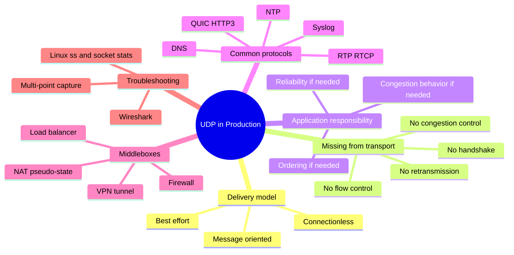

### 1.6 Misconceptions

- UDP is not simply "TCP without reliability" as a drop-in replacement; applications must actively design for loss/reordering/duplication if they matter.
- "Connectionless" does not mean stateless everywhere in the path — NAT/firewalls commonly create pseudo-connection state for UDP even though UDP itself has none.
- A missing UDP response does not always mean packet loss; it can also mean the receiving application never replied, or replied to the wrong tuple.

### 1.7 Troubleshooting Questions

- Did the datagram leave the sender's interface at all?
- Did it arrive at the destination interface unmodified (fragmentation, NAT translation, MTU truncation)?
- Did the destination application actually read it, or did it sit in the socket receive buffer/get dropped due to buffer pressure?
- Is a "timeout" symptom actually an application retry policy expiring, not a network-level failure?

### 1.8 What I Should Remember

- UDP is best-effort, message-oriented delivery over IP, with no transport-layer state machine.
- Any ordering, retry, or congestion-aware behavior seen "on UDP" is implemented by the application or a protocol layered on UDP, not by UDP itself.

## 2. Encapsulation and Datagram Structure

### 2.1 Layers and Units

### Diagram 2: UDP/IP Encapsulation


ASCII fallback:

```text
[Eth hdr][IP hdr][UDP hdr][App bytes]
```

- Datagram: UDP unit; typically maps 1:1 to one application message.
- Packet: IP unit.
- Frame: L2 unit.
- Unlike TCP, there is no segmentation/reassembly of an ongoing byte stream — each UDP datagram is independent, though an application may split one logical message across multiple datagrams itself (e.g., DNS message splitting is not a thing over UDP; large responses instead trigger TCP fallback or EDNS0 buffer negotiation).

### 2.2 MTU, Fragmentation, and PMTUD for UDP

- **MTU**: Max L3 payload on a link, same concept as TCP.
- **No MSS-like negotiation**: UDP has no handshake and no MSS option, so there is no automatic per-path payload sizing negotiated by the transport itself.
- **IP fragmentation**: A UDP datagram larger than the path MTU is fragmented at the IP layer (or dropped with `ICMP Fragmentation Needed` if the `DF` bit is set and PMTUD is used). Because UDP has no retransmission of partial loss, losing **any one fragment** causes the **entire datagram** to be discarded at the receiver.
- **Practical guidance ([COMMON])**: Applications sending UDP over paths with unknown/uncertain MTU (VPNs, tunnels, encapsulation) commonly keep payloads well under 1400-1200 bytes to avoid fragmentation, especially for latency-sensitive traffic like DNS, RTP, and QUIC.
- **EDNS0 buffer size** [APP-LAYER] is a DNS-specific example of an application negotiating its own effective "MTU-aware" limit on top of plain UDP.

### 2.3 Production Scenario: VPN Tunnel Fragmentation Black Hole for UDP

Symptom: DNS-over-UDP or RTP media intermittently vanishes only for larger responses/packets.

Likely pattern:

- Small datagrats (queries, RTCP reports) succeed.
- Larger datagrams (large DNS responses, video RTP frames) are fragmented by IP.
- One fragment is dropped by a firewall or path MTU mismatch inside the tunnel.
- Entire datagram is silently lost; UDP reports nothing back to the sender.

Wireshark signs:

```wireshark
ip.flags.mf == 1 or ip.frag_offset > 0
udp.length > 1400
```

### 2.4 What I Should Remember

- Because UDP cannot retransmit part of a datagram, fragmentation loss looks like "the whole message vanished," not a partial retransmission pattern like TCP shows.
- MTU/tunnel overhead mismatches are a very common root cause of "works for small payloads, fails for large ones" UDP symptoms.

## 3. UDP Header in Depth

### Diagram 3: UDP Header Structure

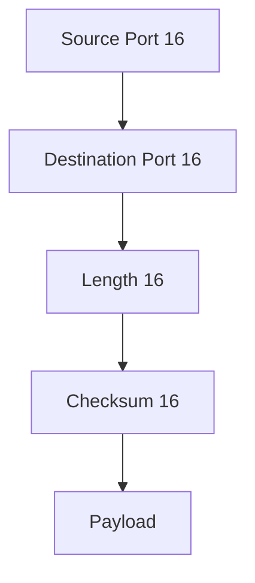

| Field | Purpose | Notes |
|---|---|---|
| Source Port | Socket demux on sender side | May be 0 in rare cases (unusual, discouraged) |
| Destination Port | Socket demux on receiver side | Required, non-zero for delivery |
| Length | Length of UDP header + payload in bytes | Minimum value is 8 (header only, no payload) |
| Checksum | Optional (IPv4) / effectively required (IPv6) integrity check over pseudo-header + UDP header + data | If zero in IPv4 and unused, means "not computed"; IPv6 requires a non-zero checksum in almost all cases |

Total header size: **8 bytes fixed**, no options, no variable-length extension mechanism — this is the biggest structural difference from TCP's 20+ byte, option-extensible header.

### 3.1 What I Should Remember

- The UDP header is fixed-size and minimal; there is no room for options like MSS, window scale, SACK, or timestamps.
- Because the header is so simple, almost all "protocol behavior" questions about a UDP-based application are actually questions about the application/protocol layered on top, not about UDP.

## 4. Connectionless Model: No Handshake

### Mechanism, Need, and Activation

- **What**: There is no SYN/SYN-ACK/ACK equivalent. The first datagram sent to a destination port simply arrives (or doesn't); the first response (if any) simply arrives back.
- **Why**: Removing handshake overhead reduces latency for single-request/response or streaming use cases and avoids allocating durable transport state for lightweight or fan-out traffic.
- **When active**: Immediately upon calling `sendto()`/`send()` on a UDP socket; no prior negotiation phase exists.

### Diagram 4: UDP Request/Response (No Handshake)

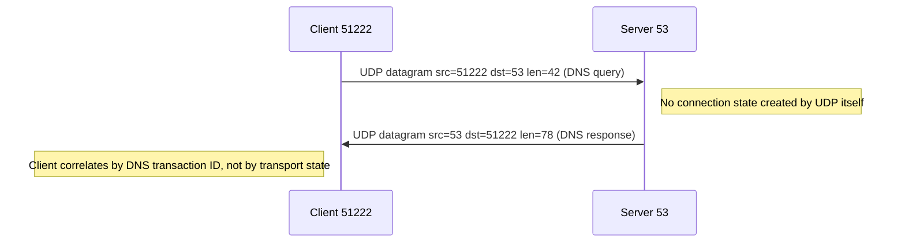

### Abnormal Patterns

- No response at all -> could be: drop in transit, server never received it, server received but never replied, or reply sent to a different/incorrect tuple.
- `ICMP Port Unreachable` -> destination host reachable but nothing is listening on that UDP port.
- Reply arrives from a different source port than expected -> common for some server architectures (e.g., connected UDP sockets per worker) and not inherently an error.

Wireshark filters:

```wireshark
udp.port == 53
icmp.type == 3 and icmp.code == 3
```

### 4.1 What I Should Remember

- There is no notion of "connection established" for UDP at the transport layer; any perceived "session" is an application-layer or middlebox-layer construct.
- `ICMP Port Unreachable` is one of the few transport-adjacent signals UDP troubleshooting gets almost for free; TCP's equivalent signal is usually a RST instead.

## 5. Checksum, Length, and Integrity

### Core Rules

- **Length field [SPEC]**: Total UDP length (header + data) in bytes; used together with the IP header's length to detect certain truncation issues.
- **Checksum [SPEC/COMMON]**: Computed over a pseudo-header (source IP, destination IP, protocol, UDP length) plus the UDP header and data.
  - **IPv4**: Checksum is optional; a value of `0x0000` means "no checksum computed" **[COMMON on some stacks/configs]**. Widely enabled by default in practice.
  - **IPv6**: Checksum is effectively mandatory for standard UDP (a documented zero-checksum mode exists only for specific tunneling protocols and must be explicitly enabled).
- **UDP-Lite**: A related protocol (not classic UDP) that allows partial checksum coverage for loss-tolerant media; distinct from standard UDP and not interchangeable with it.

### Failure Symptom

- A corrupted UDP datagram that fails checksum validation is silently dropped by the receiving stack **[SPEC]** — there is no error signal back to the sender, and no retransmission is triggered by the transport layer.

### 5.1 What I Should Remember

- UDP integrity checking is binary: pass or silently drop. There is no partial-acceptance or automatic recovery path at the transport layer.
- A "missing response" investigation should consider checksum-invalidated drops as one of several silent-loss causes, especially across paths with NAT/tunnel header rewriting bugs.

## 6. Fragmentation, MTU, and Path Issues

(See also [Section 2](#2-encapsulation-and-datagram-structure) for the encapsulation view.)

### Diagram 5: Fragmentation and All-or-Nothing Loss

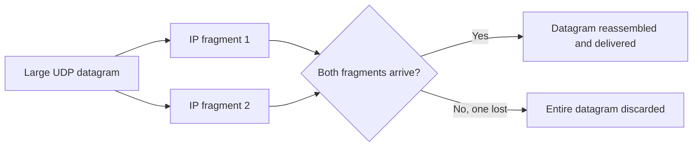

### Diagnostic Signs

- Symptom scales with payload size: small requests succeed, large ones fail or stall.
- Path shows `DF` bit set with no returning `ICMP Fragmentation Needed` (black hole) **[COMMON failure pattern]**, or `DF` not set and silent fragment loss occurs somewhere in the path.
- Capturing at both ends shows fragments leaving the sender but an incomplete set arriving at the receiver.

### Mitigations Discussed With Users (Not Applied Automatically)

- Reduce application payload size below conservative MTU assumptions for tunneled/VPN paths.
- Ensure ICMP needed for PMTUD is permitted end-to-end where feasible.
- For latency-sensitive protocols (RTP, QUIC), prefer designs that avoid fragmentation entirely rather than relying on it.

### 6.1 What I Should Remember

- Fragmentation loss is invisible to UDP itself; only capture evidence (fragment flags/offsets) or application-level timeout patterns reveal it.
- "Small packets work, big packets don't" is one of the strongest signals pointing at MTU/fragmentation rather than generic congestion or app bugs.

## 7. Absence of Flow Control and Congestion Control

### Core Point

- **[SPEC]** UDP has no `rwnd`-equivalent receiver window advertisement and no `cwnd`-equivalent sender-side congestion window.
- A fast sender can overrun a slow receiver's socket buffer, causing the OS to silently drop incoming datagrams once the receive buffer is full **[OS-SPECIFIC]**.
- A UDP sender can also overrun network paths, contributing to congestion that harms itself and other flows, unless the application implements its own congestion-aware pacing (as QUIC does).

### Diagram 6: Receiver Buffer Overrun (No Flow Control)

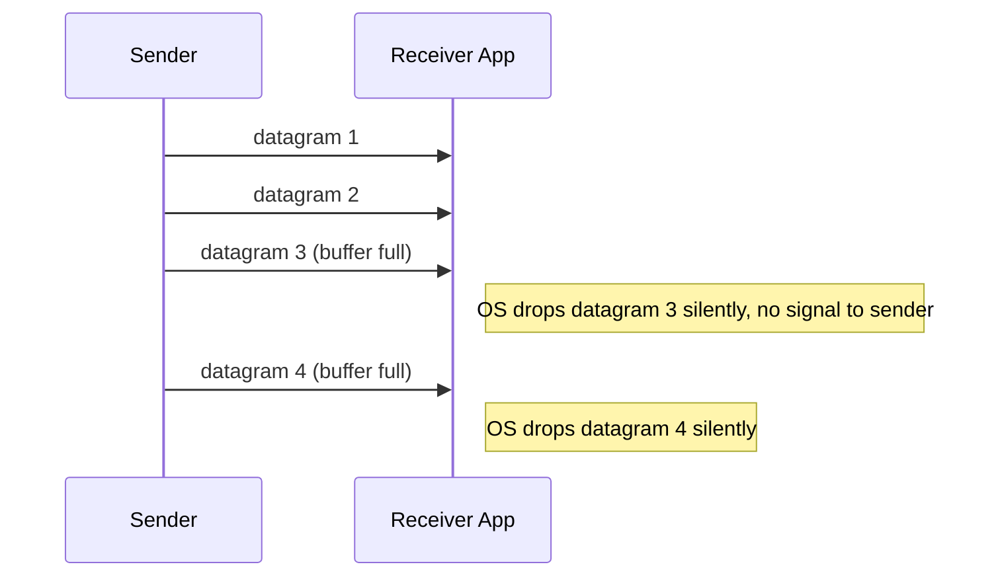

### Practical Consequences

- High-rate UDP senders (telemetry, media, syslog) can cause silent receive-side drops that are invisible unless the receiving host's UDP drop counters are checked.
- Because there's no automatic backoff, misbehaving or misconfigured UDP senders can contribute to bufferbloat/congestion on shared links; this is why RFC 8085 recommends applications implement congestion-aware behavior when sending UDP at any significant rate.

### 7.1 What I Should Remember

- Any perceived "flow control" or "congestion control" for a UDP-based protocol (e.g., QUIC, custom RTP congestion control) is implemented above UDP, not by UDP.
- Receive-side drops due to buffer overrun are silent to the sender; only receiver-side counters/logs reveal them.

## 8. Timeouts and Retries at the Application Layer

### Core Point

- **[APP-LAYER]** Since UDP has no retransmission timer, every UDP-based protocol that needs reliability defines its own timeout and retry policy (e.g., DNS resolver retry/timeout, NTP poll intervals, TFTP block acknowledgements and retransmits, custom RPC-over-UDP retry logic).
- These application timers are unrelated to TCP's RTO/backoff mechanics and can vary enormously between protocols and implementations.

### Diagram 7: Application-Layer Retry Over UDP

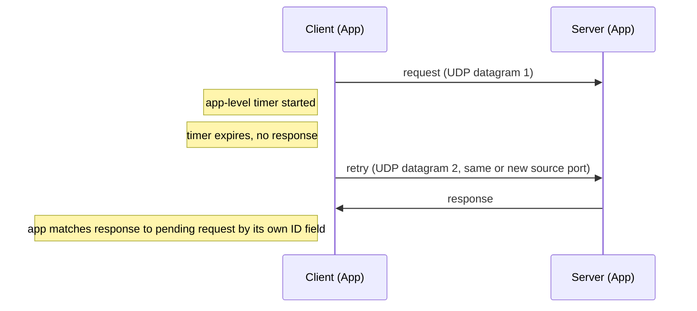

### Troubleshooting Implication

- A "slow" or "failing" UDP-based request should first be checked against the specific application's documented timeout/retry values, not against generic transport-layer expectations.
- Repeated identical-looking requests in a capture are normal application-level retries, not a transport anomaly.

### 8.1 What I Should Remember

- There is no single "UDP timeout"; always identify which application/protocol layer owns the retry and timeout logic being observed.

## 9. Packet Loss, Reordering, and Duplication

### Core Rules

- **[SPEC]** UDP provides no loss detection, no reordering correction, and no duplicate suppression at the transport layer.
- A datagram can arrive out of order relative to a previous one sent on the same 4-tuple; UDP delivers it to the application as-is, in receive order, with no reordering buffer.
- A datagram can be delivered more than once if duplicated somewhere in the path (rare, but possible with certain L2/L3 retransmission or misconfigured redundant paths); UDP does not detect or suppress this.

### Diagram 8: Reordering Delivered As-Is

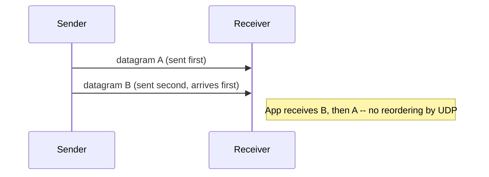

### Scenario Matrix

| Scenario | UDP transport behavior | Who must handle it |
|---|---|---|
| Datagram lost | No signal generated, no retransmission | Application (if it needs reliability) |
| Datagram reordered | Delivered in arrival order | Application (sequence numbers, jitter buffer) |
| Datagram duplicated | Both copies delivered | Application (idempotency/dedup logic) |
| Fragment lost | Entire datagram discarded | Application, if it retries the whole message |

### 9.1 What I Should Remember

- Loss, reordering, and duplication are all "normal" possible outcomes for UDP; whether they matter depends entirely on what the application does about them.
- Capture evidence for UDP loss usually means comparing sender-side send counts against receiver-side arrival counts across multiple capture points, since there are no transport-layer artifacts (no dupACK, no retransmission flag) to lean on.

## 10. Reliability Built Above UDP

### Common Patterns [APP-LAYER]

- **Request IDs / transaction IDs**: DNS transaction ID, RPC correlation ID — used to match responses to requests and detect duplicates.
- **Explicit ACK + retransmit**: TFTP block-level ACKs, custom control-plane protocols.
- **Sequence numbers + jitter buffer**: RTP sequence numbers reorder media at the receiver without transport-layer help.
- **Full reliable/congestion-aware transport over UDP**: QUIC implements its own packet numbers, ACK frames, loss detection, and congestion control entirely at the application/library layer while using plain UDP datagrams underneath.

### Diagram 9: Reliability Layer Stacked on UDP

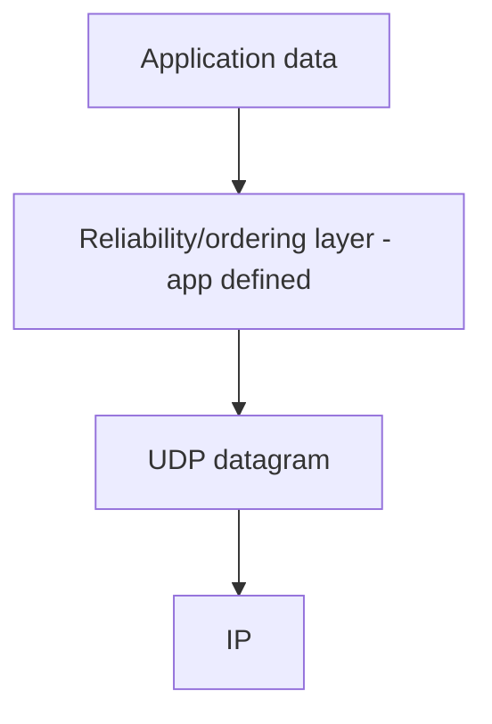

### 10.1 What I Should Remember

- "Reliable UDP" is never a property of UDP itself — it always means a reliability layer was added on top (QUIC, RTP+jitter buffer, custom ACK scheme, etc.).
- When troubleshooting a "reliable" UDP-based protocol, the relevant loss/retry/congestion logic lives in that protocol's own specification and logs, not in generic transport captures alone.

## 11. Multicast and Broadcast with UDP

### Core Point

- UDP is commonly used for one-to-many delivery patterns that TCP cannot support directly: IP multicast (e.g., `224.0.0.0/4` group addresses) and IP broadcast, both rely on UDP's connectionless, non-stateful model.
- **[COMMON]** Applications: service discovery (mDNS/SSDP), some routing protocols, financial market data feeds, IPTV.
- Multicast delivery depends on IGMP/MLD group membership and multicast routing (PIM, etc.) in the network — these are separate protocols from UDP itself but are frequently implicated in "some hosts get the feed, others don't" style incidents.

### Diagram 10: Multicast Fan-Out

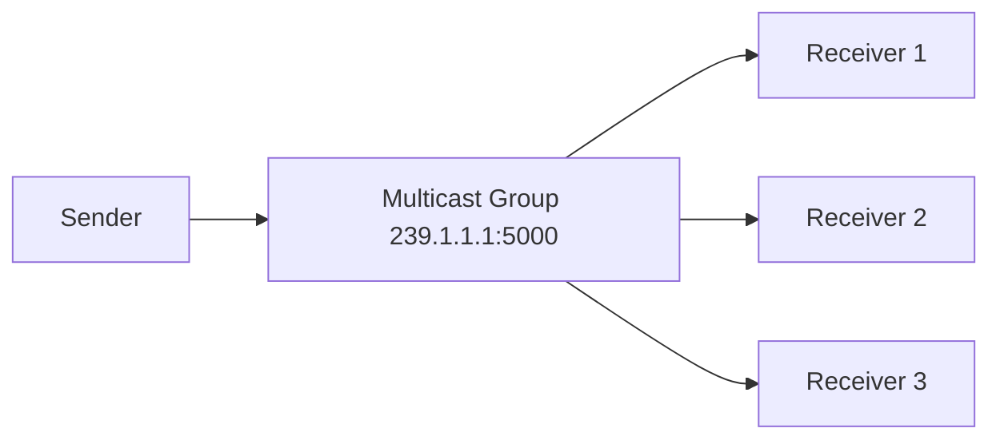

### Troubleshooting Note

- If some receivers get multicast traffic and others do not, first check IGMP/MLD membership and multicast routing/ACLs on the path before suspecting UDP or the sending application.

### 11.1 What I Should Remember

- Multicast/broadcast delivery correctness is primarily a network-routing/group-membership problem, not a UDP transport problem.

## 12. Pseudo-Connections: NAT and Stateful Tracking of UDP

### Core Point

- Even though UDP has no transport-layer connection state, NAT devices and stateful firewalls commonly create a **pseudo-connection entry** (source/destination tuple + an idle timeout) to allow return traffic back through **[COMMON]**.
- This pseudo-state has **no relationship to any UDP protocol mechanism** — it is entirely a middlebox implementation detail, and its timeout values are configurable and vary by vendor.

### Diagram 11: NAT Pseudo-State for UDP

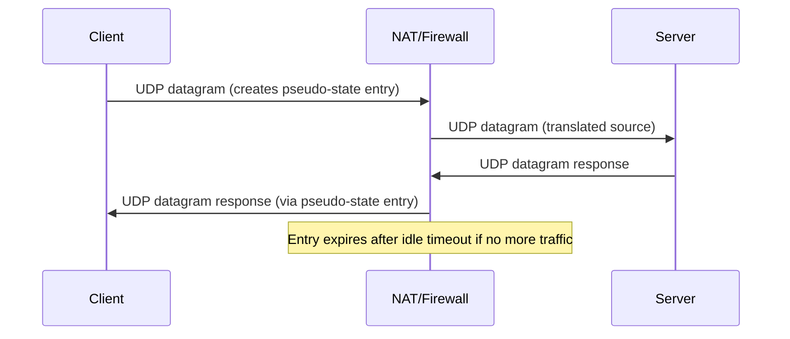

### Production Impact

- If the application's natural request interval is longer than the NAT/firewall UDP idle timeout, the pseudo-state expires between requests, and the *next* request may fail or be misrouted until it re-establishes state — commonly the root cause of "works for a while, then intermittently fails" symptoms for long-lived UDP-based sessions (VoIP, VPN, gaming, some VPN protocols like IPsec/IKE or WireGuard over UDP).
- Common mitigation discussed with users (not applied without their approval): application-level or configuration-level keepalive datagrams sent at an interval shorter than the known middlebox timeout.

### 12.1 What I Should Remember

- "UDP session" almost always means "NAT/firewall pseudo-connection state," not any actual transport-layer session.
- Idle-timeout mismatches between application behavior and middlebox UDP state tables are one of the most common production UDP incidents.

## 13. DNS over UDP

### Key Points

- Classic DNS queries/responses fit in a single UDP datagram; EDNS0 lets a resolver advertise a larger acceptable UDP response size than the historic 512-byte default **[APP-LAYER negotiation, not a UDP feature]**.
- If a response would exceed the negotiated/allowed UDP size, the server sets the `TC` (truncated) flag, and the client is expected to retry over TCP **[SPEC per DNS, not UDP]**.
- DNS transaction ID plus source port are used by the client to match responses to queries and provide a modest amount of spoofing resistance; source port randomization is a security control implemented by the resolver, not by UDP.

### Diagram 12: DNS UDP with TCP Fallback

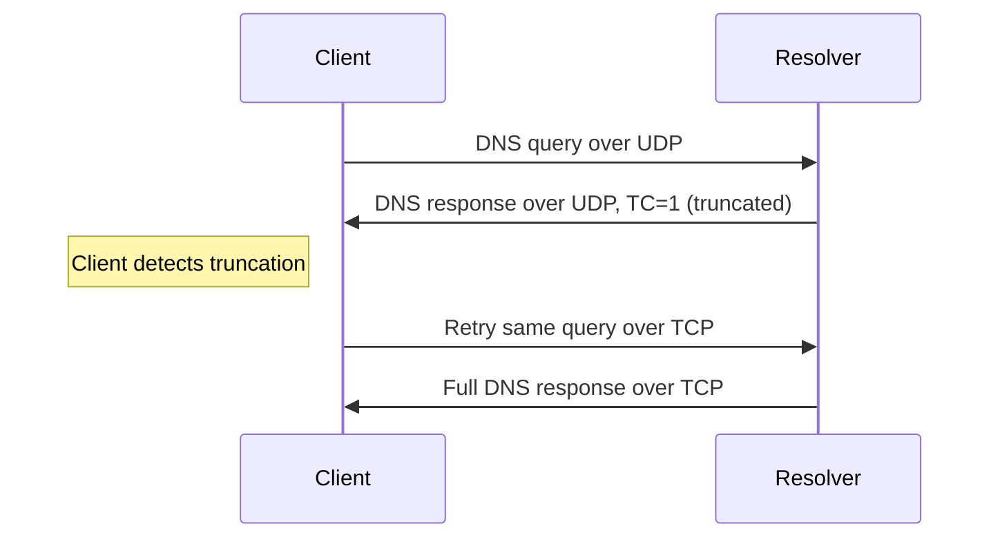

### 13.1 What I Should Remember

- DNS-over-UDP failures that "fix themselves" over TCP usually point at response-size/truncation or path MTU/fragmentation issues, not at DNS server logic bugs.

## 14. NTP over UDP

### Key Points

- NTP uses UDP port 123, exchanging small fixed-format timestamped datagrams to estimate clock offset and round-trip delay.
- Each NTP packet carries origin/receive/transmit timestamps so the client can compute offset without needing transport-layer RTT measurement.
- Firewalls that block UDP/123 or NAT devices with short idle timeouts for infrequent NTP polls are common causes of "clock drift" incidents that are actually connectivity/timeout issues, not real clock hardware problems.

### 14.1 What I Should Remember

- NTP's accuracy model depends entirely on timely UDP delivery in both directions; asymmetric drops silently degrade time sync without any transport-level error signal.

## 15. Real-Time Media (RTP/RTCP) over UDP

### Key Points

- RTP adds its own sequence number and timestamp fields on top of UDP so receivers can detect loss/reordering and reconstruct timing, entirely at the application layer.
- RTCP provides periodic reception-quality reports (loss fraction, jitter) alongside the RTP media stream, also over UDP.
- Because there is no transport-layer retransmission, lost RTP packets are typically **not** retransmitted; instead, codecs conceal loss (packet loss concealment) or, in some designs, request a new keyframe.

### Diagram 13: RTP Loss Handled by Jitter Buffer, Not UDP

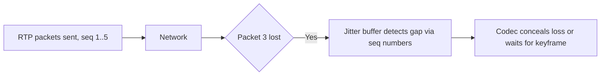

### 15.1 What I Should Remember

- Voice/video "glitches" from UDP loss are handled (or not) entirely by the media application's jitter buffer and codec, never by UDP retransmission.

## 16. QUIC and Modern UDP-Based Transports

### Key Points

- QUIC (and HTTP/3 built on it) runs entirely over UDP but reimplements, at the application/library layer, functionality analogous to TCP: packet numbers, acknowledgements, loss detection, congestion control, and (with TLS 1.3 integrated) encrypted transport-level handshakes.
- From a packet-capture standpoint, QUIC traffic looks like UDP datagrams to/from port 443 (commonly) with encrypted payloads; most "TCP-style" troubleshooting techniques (seq/ack tracking, retransmission flags) do not apply directly since that state lives inside the encrypted QUIC layer, not in the visible UDP/IP headers.
- Middleboxes that rate-limit, block, or mishandle UDP (assuming it is "just DNS-sized traffic") are a common source of QUIC connection failures that force fallback to TCP/TLS/HTTP-2.

### 16.1 What I Should Remember

- QUIC is proof that "reliable, congestion-controlled" behavior can be fully implemented over UDP — but that logic is invisible to plain packet-header analysis and must be examined via QUIC-aware tooling or endpoint logs.

## 17. Production Devices and UDP

### Diagram 14: NAT/Firewall/Load-Balancer Path for UDP


| Device | Pass-through / Terminate / Proxy | UDP state created | Common issue |
|---|---|---|---|
| Stateful firewall | Pass-through with pseudo-state | Idle-timeout tracked entry | Timeout shorter than app's natural interval |
| NAT/PAT | Pass-through with tuple rewrite | Idle-timeout tracked mapping | Port/mapping expires, breaks long-lived flows |
| VPN gateway | Tunnel endpoint, encapsulates UDP (or runs over UDP itself, e.g. IPsec NAT-T, WireGuard) | Tunnel session plus inner pseudo-state | MTU/fragmentation overhead issues |
| Reverse proxy / L7 LB | Usually terminates and relays for UDP-aware protocols (e.g., DNS, QUIC) | Two independent legs | Backend selection/health-check timing mismatch |
| Load balancer (L4) | Often pass-through with source-tuple hashing | Session-affinity table per tuple | Re-hash on backend change breaks in-flight sessions |
| IDS/IPS | Inline inspect/drop policy | Usually pass-through + policy actions | False positive drops on legitimate large/fragmented UDP |
| Linux host | Endpoint stack | Socket receive buffer only | Silent drops on buffer overrun |
| Containers/K8s | Overlay/NAT/proxy hops | Extra pseudo-state per hop | conntrack UDP timeout mismatch, common with DNS/UDP inside clusters |

### Stateful Firewall and NAT

- Because UDP has no explicit close signal (no FIN/RST equivalent), firewalls/NAT devices **must** rely purely on idle timers to expire UDP state; this makes idle-timeout tuning far more consequential for UDP than for TCP, where FIN/RST provide an explicit signal to clear state promptly.

### 17.1 What I Should Remember

- UDP "sessions" observed at any middlebox are always idle-timer-based approximations; there is no protocol-level close event to rely on.
- Idle-timeout mismatches are the single most common production root cause across NAT, firewall, and load-balancer incidents involving UDP.

## 18. Wireshark Analysis

Practical focus points for UDP:

- Conversation statistics (`Statistics > Conversations > UDP`) to compare sent vs. received counts per tuple across capture points.
- IP fragmentation flags/offsets, since UDP loss often manifests as fragment loss.
- Length field vs. actual captured length, to catch truncated/malformed datagrams.
- Application-layer dissectors (DNS, NTP, RTP, QUIC) layered on top of the UDP dissector — most useful diagnosis happens here, not in the plain UDP header.
- ICMP messages correlated by time/tuple (`Port Unreachable`, `Fragmentation Needed`) as the closest thing UDP troubleshooting has to TCP's RST/retransmission signals.

Common filters:

```wireshark
udp
udp.port == 53
udp.port == 123
udp.length > 1400
ip.flags.mf == 1 or ip.frag_offset > 0
icmp.type == 3 and icmp.code == 3
icmp.type == 3 and icmp.code == 4
rtp
quic
```

Limitations:

- No retransmission/duplicate-ACK markers exist for plain UDP; loss must be inferred by comparing multi-point captures or application-layer sequence fields (RTP, QUIC packet numbers).
- Encrypted UDP-based protocols (QUIC, DTLS, WireGuard) hide most useful state inside encrypted payloads; captures alone cannot show loss recovery internals.

### 18.1 What I Should Remember

- For UDP, Wireshark's plain transport-layer view is far less informative than for TCP; most real diagnosis comes from the application-layer dissector or from comparing multiple capture points.

## 19. Linux Troubleshooting

Useful commands:

```bash
ss -uan
ss -uanp
netstat -su
nstat -az | egrep 'Udp|IpExt'
cat /proc/net/udp
cat /proc/net/snmp | grep -i udp
tcpdump -i any -nnvvv udp and host <peer-ip>
tshark -r capture.pcapng -Y "udp.port == 53"
sysctl net.core.rmem_max
sysctl net.core.rmem_default
conntrack -L -p udp
```

Inspection goals:

- Receive/send error and drop counters (`netstat -su`, `nstat`) to catch silent buffer-overrun drops.
- Socket receive buffer sizing (`SO_RCVBUF` / `net.core.rmem_*`) for high-rate UDP receivers.
- conntrack UDP entries and their timeouts on Linux-based NAT/firewall hosts.
- Correlating `/proc/net/udp` or `ss -uanp` with the owning process to confirm whether an application is actually reading datagrams promptly.

Risk note:

- Do not change kernel buffer or conntrack timeout parameters in production without scope, rollback, and validation plan.

### 19.1 What I Should Remember

- Linux UDP visibility centers on drop/error counters and socket buffer state, since there is no per-flow transport state to inspect like TCP's `ss -ti`.

## 20. Troubleshooting Methodology

Repeatable workflow:

1. Define user-visible symptom (no response, intermittent loss, degraded media quality, size-dependent failure).
2. Map every hop and identify which devices create pseudo-state for the UDP flow (NAT, firewall, LB).
3. Collect simultaneous captures at multiple points.
4. Compare sent vs. received datagram counts per tuple across capture points.
5. Check for IP fragmentation and any accompanying ICMP signals.
6. Check receiver-side drop/error counters and socket buffer sizing.
7. Identify the application-layer protocol's own retry/timeout/sequence behavior (DNS, NTP, RTP, QUIC) and inspect it with the appropriate dissector.
8. Correlate failures with known middlebox idle-timeout values.
9. Compare a working flow vs. a failing flow of the same protocol.
10. Separate evidence from assumption.
11. Validate root-cause hypothesis safely.

### Diagram 15: UDP Troubleshooting Decision Tree

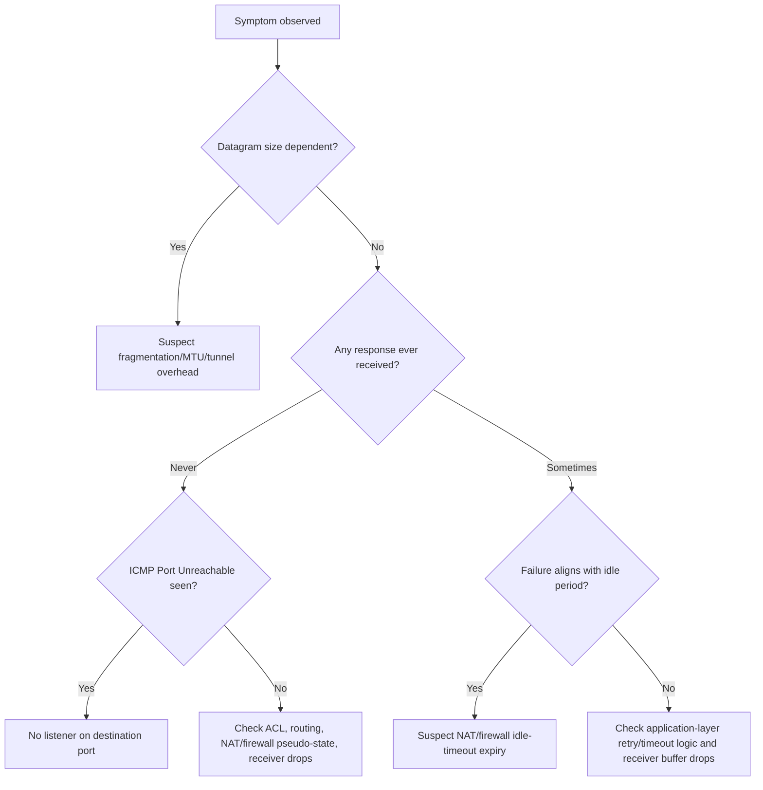

### 20.1 What I Should Remember

- Evidence-first methodology applies just as much to UDP as TCP, but the evidence sources differ: counters, fragmentation flags, ICMP, and application-layer sequence fields replace TCP's retransmission/ACK analysis.

## 21. Complete Production Case Studies

### Case 1: DNS responses failing only for large records

| Field | Detail |
|---|---|
| Topology | Client -> Firewall -> Resolver |
| User-visible symptom | Lookups for records with many answers (e.g., large TXT/SPF) intermittently fail |
| Expected flow | UDP query, UDP response, or `TC=1` with clean TCP fallback |
| Actual flow | UDP response fragments partially lost; no TCP fallback observed |
| Key fields | `udp.length`, `ip.flags.mf`, `ip.frag_offset` |
| Wireshark filter | `ip.flags.mf == 1 or ip.frag_offset > 0` |
| Evidence | Only multi-fragment responses fail; single-fragment ones succeed |
| Possible causes | Firewall dropping non-first fragments, path MTU mismatch |
| Distinguishers | Compare fragment counts/arrival at both firewall interfaces |
| Next capture point | Firewall inside/outside interfaces |
| Safe validation | Temporary rule permitting fragments for test resolver, with rollback |
| Learning point | Large single-datagram UDP responses are fragmentation-fragile; TCP fallback existing doesn't help if it's never triggered client-side |

### Case 2: VoIP call audio choppy after ~30 seconds of silence

| Field | Detail |
|---|---|
| Topology | Phone -> NAT -> SBC -> PSTN gateway |
| User-visible symptom | One-way or no audio after a hold period |
| Expected flow | RTP/RTCP continues flowing bidirectionally |
| Actual flow | Return RTP dropped after NAT idle timeout during silence suppression |
| Key fields | Gap in RTP sequence numbers correlated with idle duration |
| Wireshark filter | `rtp` with time-delta inspection |
| Evidence | NAT idle timeout shorter than silence-suppression gap |
| Possible causes | NAT UDP timeout misconfiguration, missing RTP keepalive/comfort noise packets |
| Distinguishers | Compare NAT conntrack timeout to observed silence gap length |
| Next capture point | NAT inside/outside interfaces |
| Safe validation | Enable comfort-noise/keepalive packets in test call, verify against tuned timeout |
| Learning point | Idle-timeout mismatches between application silence behavior and NAT UDP state cause classic "call drops after hold" symptoms |

### Case 3: QUIC/HTTP3 connections falling back to TCP intermittently

| Field | Detail |
|---|---|
| Topology | Client -> Enterprise firewall/proxy -> CDN edge |
| User-visible symptom | Some sessions use HTTP/3, others silently downgrade to HTTP/2 over TCP |
| Expected flow | UDP/443 QUIC handshake completes |
| Actual flow | UDP/443 traffic rate-limited or blocked by policy; client times out and falls back |
| Key fields | No response to initial QUIC UDP packets on affected paths |
| Wireshark filter | `udp.port == 443 and quic` |
| Evidence | Consistent one-directional silence on UDP/443 for affected clients only |
| Possible causes | Firewall UDP policy treating large/frequent UDP as suspicious, rate-limiting |
| Distinguishers | Compare affected vs. unaffected network segments/policies |
| Next capture point | Client-side and firewall egress |
| Safe validation | Test policy exception for UDP/443 to known CDN ranges |
| Learning point | UDP-based modern protocols can be silently degraded by legacy "UDP is just DNS" firewall assumptions |

### Case 4: Backend metrics/telemetry silently losing datapoints under load

| Field | Detail |
|---|---|
| Topology | Many agents -> UDP telemetry collector |
| User-visible symptom | Missing metrics only during traffic spikes |
| Expected flow | Every sent UDP datagram is received and processed |
| Actual flow | Receiver socket buffer overruns during bursts; OS drops excess datagrams silently |
| Key fields | Receiver-side UDP receive error/drop counters |
| Wireshark filter | N/A at packet level; requires host counters (`netstat -su`) |
| Evidence | Sender send counts exceed receiver processed counts during spikes; no corresponding network-level loss at other hops |
| Possible causes | Undersized `SO_RCVBUF`, collector process too slow to drain socket |
| Distinguishers | Compare NIC-level drop counters vs. socket-level UDP drop counters |
| Next capture point | Collector host, both NIC and socket layers |
| Safe validation | Increase `SO_RCVBUF`/`rmem` in staging, replay burst load, compare drop counts |
| Learning point | High-rate UDP receivers need adequate buffering and fast draining; there is no flow control to protect them automatically |

### 21.1 What I Should Remember

- UDP incidents cluster around a few recurring themes: fragmentation/MTU, NAT/firewall idle-timeout mismatch, receiver buffer overrun, and middlebox policies unfamiliar with modern UDP-based protocols like QUIC.

## 22. Interview and Self-Assessment

### 22.1 Foundational Questions (20)

1. What does "connectionless" mean for UDP?
2. Why does UDP preserve application message boundaries while TCP does not?
3. What fields make up the UDP header?
4. Is the UDP checksum mandatory in IPv4? In IPv6?
5. What happens to a UDP datagram that fails checksum validation?
6. Why does losing one IP fragment discard the entire UDP datagram?
7. Does UDP have a retransmission timer?
8. Does UDP provide ordering guarantees?
9. Can a single UDP datagram be delivered twice to an application?
10. What is `ICMP Port Unreachable` telling you?
11. What is the minimum and typical size of a UDP header?
12. Why is NAT/firewall state for UDP always idle-timer based?
13. What is EDNS0 and which layer defines it?
14. Why can DNS responses fall back to TCP?
15. Does UDP provide congestion control?
16. What layer implements RTP jitter buffering?
17. What is QUIC's relationship to UDP?
18. Why is UDP commonly used for multicast?
19. What creates "session" state for UDP at a firewall?
20. Why is Wireshark's plain UDP view less informative than its TCP view?

<details>
<summary>Answers: Foundational 20</summary>

1. No handshake or persistent transport-layer state between sender and receiver.
2. UDP delivers one datagram per send call; TCP delivers an undifferentiated byte stream.
3. Source port, destination port, length, checksum.
4. Optional in IPv4 (zero means unused in common config); effectively required in IPv6.
5. It is silently dropped by the receiving stack with no error returned to the sender.
6. UDP has no mechanism to retransmit or reassemble partial data; all fragments are required for reassembly.
7. No.
8. No.
9. Yes, if duplicated somewhere in the path; UDP does not detect or suppress duplicates.
10. The destination host is reachable but nothing is listening on that UDP port.
11. 8 bytes minimum (header only); no fixed "typical" size, it depends on payload.
12. Because UDP has no explicit close signal (no FIN/RST equivalent) to tell the middlebox the flow ended.
13. A DNS extension letting a resolver advertise a larger acceptable UDP response size; defined by DNS, not UDP.
14. When the response is too large for the negotiated UDP size, the server sets `TC=1` and the client retries over TCP.
15. No.
16. The application/media layer (RTP receiver logic), not UDP.
17. QUIC uses UDP as its underlying transport while implementing its own reliability/congestion control above it.
18. UDP's connectionless model supports one-to-many delivery without per-recipient transport state.
19. An idle-timeout-tracked pseudo-connection entry keyed on the tuple, purely a middlebox construct.
20. Because UDP has no transport-level artifacts like retransmission flags or ACKs to analyze; most insight comes from application-layer dissectors or multi-point comparisons.

</details>

### 22.2 Intermediate and Scenario Questions (15)

1. A UDP-based application "hangs" occasionally after long idle periods but works immediately after restart — what do you check first?
2. Large UDP responses fail over a VPN but small ones succeed — what's the leading hypothesis?
3. A telemetry collector shows gaps in data only during traffic spikes, with no evidence of network loss elsewhere — what's the likely cause?
4. Why might comparing sender and receiver datagram counts at multiple capture points be more useful for UDP than looking for "retransmission" markers?
5. Why does QUIC traffic sometimes silently fall back to TCP in enterprise networks?
6. Why is an `ICMP Port Unreachable` a stronger signal than "no response at all"?
7. Why would enabling a periodic keepalive datagram fix an intermittent VoIP audio drop?
8. What's the difference between UDP "session" and TCP "session" from a firewall's point of view?
9. Why can't Wireshark flag "duplicate" or "retransmitted" UDP datagrams the way it does for TCP?
10. Why does RTP add its own sequence numbers if UDP already has a header?
11. What's a safe way to validate a hypothesized NAT idle-timeout mismatch without disrupting production?
12. Why might increasing `SO_RCVBUF` help a high-throughput UDP receiver?
13. Why is fragmentation especially risky for latency-sensitive protocols like RTP/QUIC?
14. Why does multicast delivery troubleshooting often start at IGMP/routing rather than the UDP layer?
15. What evidence would definitively prove a firewall middlebox generated a silent drop versus the destination application simply not responding?

<details>
<summary>Answers: Intermediate 15</summary>

1. NAT/firewall UDP idle-timeout expiry during the idle period, since UDP has no keepalive of its own unless the application adds one.
2. IP fragmentation loss inside the tunnel (one lost fragment discards the whole datagram); check tunnel MTU/overhead.
3. Receiver socket buffer overrun during bursts (no flow control to throttle the sender); check host-level UDP drop counters.
4. Because UDP has no retransmission flags or ACKs; comparing raw sent-vs-received counts across capture points is the only direct way to prove loss and locate where it occurred.
5. Firewalls/proxies may block, rate-limit, or otherwise mishandle UDP/443 due to unfamiliarity with QUIC, causing client-side timeout and fallback to TCP.
6. It's an explicit signal that the destination host is reachable but nothing is listening, versus generic silence which could mean many different failure points.
7. It refreshes the NAT/firewall pseudo-state before its idle timeout expires, preventing state loss during natural silence periods.
8. TCP session state is created/torn down via explicit handshake/FIN/RST signals; UDP "session" state is purely an idle-timer-based approximation with no explicit close event.
9. UDP has no sequence/ack fields at the transport layer for Wireshark's TCP analysis heuristics to key off of; any such tracking must come from an application-layer dissector (e.g., RTP, QUIC).
10. To let the receiver detect loss, reordering, and reconstruct timing itself, since UDP provides none of that.
11. Reproduce the pattern in a controlled test flow, capture at the NAT/firewall boundary, and compare observed idle duration against the device's configured timeout, with a rollback plan for any config change.
12. It gives the kernel more room to queue incoming datagrams before the application drains them, reducing overrun-related silent drops during bursts.
13. Losing a single fragment discards the whole datagram, which for time-sensitive media/QUIC packets directly causes visible quality/connection issues rather than a quiet retransmission.
14. Because correct multicast delivery depends on group membership (IGMP/MLD) and multicast routing configuration, which are separate from whether UDP itself is functioning correctly.
15. Synchronized captures on both sides of the middlebox showing the datagram entering but never leaving, correlated with the middlebox's session/policy logs.

</details>

### 22.3 What I Should Remember

- Interview-quality UDP troubleshooting reasoning centers on knowing precisely what UDP does *not* provide, and correctly attributing any observed reliability/ordering/congestion behavior to the right application layer or middlebox.

## 23. Final Reference Material

### 23.1 Glossary

- **Datagram**: UDP protocol data unit; typically maps to one application message.
- **Packet**: IP protocol data unit.
- **Frame**: Layer-2 protocol data unit.
- **Pseudo-connection / pseudo-state**: Idle-timer-based tracking entry created by NAT/firewalls for UDP flows; not a UDP protocol feature.
- **PMTUD**: Path MTU Discovery, relevant to UDP fragmentation avoidance just as with TCP.
- **Jitter buffer**: Application-layer buffer (e.g., in RTP receivers) that reorders/smooths delivery timing; not part of UDP.

### 23.2 UDP Header Fields Cheat Sheet

| Field | Meaning |
|---|---|
| Source Port | Sender's socket port |
| Destination Port | Receiver's socket port |
| Length | Header + payload length in bytes |
| Checksum | Optional (IPv4) / required (IPv6) integrity check |

### 23.3 UDP vs TCP Quick Comparison

| Aspect | UDP | TCP |
|---|---|---|
| Connection setup | None | 3-way handshake |
| Reliability | None (app-provided if needed) | Built-in retransmission |
| Ordering | None (app-provided if needed) | Built-in |
| Flow control | None | `rwnd`-based |
| Congestion control | None (app-provided if needed, e.g. QUIC) | `cwnd`-based |
| Header size | Fixed 8 bytes | 20+ bytes with options |
| Typical uses | DNS, NTP, RTP/VoIP, QUIC/HTTP3, telemetry, multicast | Web (pre-HTTP/3), file transfer, databases, SSH |

### 23.4 Common Misconceptions and Corrections

- UDP always means unreliable in practice -> **No, reliability can be fully implemented above UDP (e.g., QUIC).**
- A UDP "session" is tracked by the protocol itself -> **No, any session tracking is done by middleboxes (idle-timer state) or the application, not by UDP.**
- Losing part of a large UDP message means partial data loss -> **No, IP fragmentation loss discards the entire datagram, not just the missing fragment.**
- No response means the network dropped the packet -> **Not necessarily; the destination may have received it but never replied, or replied to an unexpected tuple.**
- UDP has no security or integrity properties at all -> **It has an optional/required checksum for corruption detection; it has no encryption or authentication of its own (those come from layers like DTLS/QUIC/IPsec).**

### 23.5 Final Troubleshooting Checklist

1. Confirm symptom and exact time window, and whether it correlates with payload size or idle duration.
2. Map end-to-end path and identify every device creating UDP pseudo-state (NAT, firewall, LB).
3. Get synchronized captures at multiple points.
4. Compare sent vs. received datagram counts per tuple.
5. Check for IP fragmentation and any ICMP signaling.
6. Check receiver-side socket/NIC drop and error counters.
7. Identify the application-layer protocol's own retry/timeout/sequencing logic and inspect with its dissector.
8. Correlate failures with known middlebox idle-timeout values.
9. Compare a working flow vs. a failing flow of the same protocol.
10. State evidence and assumptions separately.
11. Run a safe validation experiment.
12. Document confirmed root cause and prevention.

### 23.6 Relevant RFCs and References

- RFC 768: User Datagram Protocol (original UDP specification).
- RFC 1122: Host requirements, including UDP clarifications.
- RFC 8085: UDP Usage Guidelines (congestion control and application design guidance).
- RFC 1071 / RFC 1141: Checksum computation guidance referenced by UDP/IP checksum rules.
- RFC 3550 / RFC 3551: RTP and RTCP.
- RFC 6455 note: Not UDP-based, referenced only for contrast with WebSocket-over-TCP designs.
- RFC 9000 / RFC 9114: QUIC transport and HTTP/3.
- RFC 1035 with RFC 6891 (EDNS0): DNS message format and UDP payload size negotiation.
- RFC 5905: Network Time Protocol version 4.

Recommended authoritative reading:

- Current Linux kernel networking docs for your deployed version (`ip(7)`, `udp(7)` man pages).
- Vendor docs for firewall/NAT/LB UDP idle-timeout behavior.
- Wireshark User's Guide and protocol dissector notes for UDP, DNS, RTP, and QUIC.

### 23.7 What I Should Remember

- UDP troubleshooting succeeds by clearly separating what the transport protocol provides (almost nothing beyond addressed, checksummed delivery) from what applications, protocols, and middleboxes add on top of it.
- Treat every "UDP session," "UDP retry," or "UDP reliability" behavior as belonging to a specific layer above UDP, and go find evidence at that layer.

---

## Quality-Control Pass (Completed)

Validated in this guide:

- Connectionless, message-oriented delivery model kept distinct from any application-layer behavior.
- Fragmentation all-or-nothing loss behavior explicitly called out.
- Flow control and congestion control absence stated plainly, with QUIC as the counter-example built above UDP.
- NAT/firewall pseudo-state explained as a middlebox construct, not a UDP feature.
- No universal fixed timer/timeout values asserted; all labeled OS-specific/configurable/app-layer as appropriate.
- Required Mermaid diagram types included and syntax kept GitHub-compatible (consistent 2-space indentation, no tabs).

End of guide.
